# Technical Design: Workforce Payroll Management SaaS

## 1. Overview

This design defines an advanced multi-tenant SaaS platform that digitizes and extends the real paper-based workforce workflow represented by the Monthly Individual Work Record Card and Employee Overtime Request Form. It preserves traceability to those artifacts—daily date/start/end/signature/remark rows, monthly summaries, planned overtime dates and times, pre-work signatures, and staggered rest-day acknowledgement—without storing or reproducing personally identifiable information from the samples.

The platform connects SaaS tenant onboarding and entitlements, two deliberately separate administration boundaries, tenant configuration, operating calendars, toolbox meetings, dual-confirmed attendance, planned overtime, exceptional Closed-day authorization, replay-resistant QR checkout evidence, supervisor verification, controlled worker acknowledgement, effective-dated compensation, and monthly payroll. A verified work ledger and the exact policy, calendar, and compensation versions applicable to each record produce explainable calculations and a versioned payroll snapshot and payslip.

A pixel-perfect copy of the paper forms is intentionally not the goal. Paper does not express authorization states, evidence provenance, disputes, version history, accessibility, mobile interaction, or recalculation impact. The UI therefore retains the recognizable monthly-card metaphor while adding a polished responsive design system, role-specific dashboards, explicit status, evidence drill-down, safe batch confirmation, and immutable audit semantics. **Confirmed**: the Worker Panel and Supervisor Panel are installable Progressive Web Apps (PWAs) that also remain fully usable in supported browsers without installation. Management/HR/Payroll, Tenant Management Admin, and Platform Admin are responsive web applications; whether those surfaces are also installable is an open product decision.

### 1.1 Decision Legend

- **Confirmed**: supplied and agreed business behavior; this design must preserve it.
- **Design proposal**: a technical approach recommended to realize confirmed behavior; it can be changed without redefining the business intent.
- **Open decision**: a policy or integration choice that must be confirmed before implementation or tenant rollout.

### 1.1.1 Decision Status Register

This register is the authoritative status summary for the additions in this revision; detailed sections below remain controlling for behavior and rationale.

| Status | Decisions |
|---|---|
| **Confirmed** | Top-tier responsive SaaS UI/UX on mobile and desktop; browser-capable installable Worker and Supervisor PWAs; comprehensive administration split between Platform Admin Console and Tenant Management Admin Panel; strict platform-versus-tenant authorization/audit separation; no implicit payroll-finalizer permission for administrators; offline actions remain Pending until server validation; post-final correction remains out of scope. |
| **Design proposal** | Distinct Worker and Supervisor manifests/start URLs over one shared design system/codebase; plan/entitlement/quota control-plane model; WCAG 2.2 AA target; localization-ready foundations; safe offline queue and retry model; push with fallback; measurable performance and UX release gates. |
| **Open decision** | Billing and entitlement policy; branding/custom domains; PWA distribution details; supported browser/device baseline; offline depth; push providers/fallback priority; initial localization; administration-surface installability; final accessibility confirmation; numeric performance and reliability budgets. |

### 1.2 Goals

1. Preserve digital traceability from each source artifact field to a typed domain record and audit event.
2. Enforce tenant isolation and permission-based maker-checker controls with least privilege and segregation of duties.
3. Make the published monthly Operating Calendar authoritative for ordinary work eligibility while supporting narrowly scoped Closed-day exceptions.
4. Produce an evidence-backed, append-only verified work ledger from attendance, checkout, supervisor verification, and worker acknowledgement.
5. Provide safe single-record and controlled batch/monthly worker confirmation without blanket signatures.
6. Calculate real-time payroll estimates deterministically from versioned inputs and clearly distinguish estimates from finalized payroll.
7. Finalize monthly payroll as an immutable, versioned snapshot and publish traceable payslips.
8. Support installable Worker and Supervisor PWA shells, safe offline retries, idempotency, concurrency control, exceptions, auditability, observability, and future integrations.
9. Provide polished, coherent, accessible, localized-ready UI/UX across mobile, tablet, and desktop, with explicit quality gates and graceful capability degradation.
10. Separate SaaS operator administration from tenant administration, with audited tenant lifecycle/support controls and no silent platform access to tenant payroll or salary data.
11. Keep payroll formulas configurable and subject to qualified Singapore PTE/MOM/contract compliance validation; this design is not legal advice.

### 1.3 Non-Goals and Boundaries

**Confirmed boundaries**:

- A Management, Tenant Administrator, or Platform Operator account is not omnipotent by default; “admin” does not imply salary access or payroll finalization.
- Platform operators must not silently inspect or mutate tenant payroll, salary, payslip, work-evidence, or identity data. Support access requires an explicit, consented, purpose-bound, time-bound session or separately governed break-glass procedure, and every action is audited.
- Offline/PWA actions remain Pending until server validation and never become authoritative merely because they were accepted into a device queue.
- The system will not hard-code or claim unverified statutory rates, eligibility rules, or legal interpretations.
- Static, shareable QR codes are not sufficient checkout proof.
- Post-final correction, revised payroll, and off-cycle payroll workflows are out of scope for this version. The data model exposes extension points but no executable correction workflow.
- A Closed date is not changed to Working when exceptional work is authorized.
- Worker batch acknowledgement is not a blanket signature over unresolved, disputed, or changed-since-review records.

**Design proposals not yet confirmed as business policy**:

- Modular service-oriented architecture beginning as a modular monolith plus asynchronous workers, with bounded-context extraction when scale requires it.
- Relational transactional storage, immutable object storage for evidence/exports, and an event outbox.
- Short-lived signed QR challenges bound to tenant, site, checkpoint, purpose, and validity window.
- Risk-ranked approval templates seeded by the platform but configurable per tenant within platform guardrails.

## 2. Source Artifact Traceability

| Physical artifact element | Digital representation | Additional digital control |
|---|---|---|
| Monthly Work Record Card, dates 1–31 | `MonthlyWorkCardView` projected from Daily Work Records and calendar rows | Working/Closed/authorized exception/status badges; source and audit drill-down |
| Date, Start Time, End Time | `WorkRecord.workDate`, versioned time segments | Time zone, source, confidence, edit reason, overlap checks |
| Worker Sign | `WorkerAcknowledgement` per record | signer identity, timestamp, record version/digest, single or batch envelope |
| Supervisor Sign | `SupervisorVerification` | verifier identity, timestamp, before/after data and reason |
| Remark | versioned reason-coded remark plus optional text | sensitive-data controls and audit trail |
| Normal Days, Overtime, Incentive | monthly projection and calculation lines | formula/rule version and source-record provenance |
| Total Advance, Total Amount | payroll calculation and payslip lines | estimate/final status; before/after adjustment impact |
| Monthly Worker Signature | optional batch acknowledgement envelope | only eligible selected records; per-record digest and changed-since-review detection |
| OT requested dates/times | `OvertimePlan` and per-date `OvertimeAssignment` | approval state, scope, planned-vs-actual comparison |
| Name and W/P No. | worker reference and protected employment identifier | no sample PII; field-level access/masking |
| Date-specific pre-work signatures | `WorkerPreWorkConsent` | exact assignment/date/time/location digest and immutable evidence |
| Staggered Rest Day signatures | policy-specific consent/acknowledgement subtype | label configurable; no legal meaning inferred |
| Completed paper example | migration evidence reference, if tenant imports it | scanned evidence access control and human-verified transcription |

## 3. Confirmed Business Decisions

1. The product is an advanced multi-tenant workforce/HR/payroll SaaS.
2. Management administers tenant configuration, sites, accounts, workers, assignments, calendars, and policies through explicit permissions.
3. Maker-checker and segregation-of-duties rules are configurable by role, risk, action, and tenant policy.
4. Every monthly calendar date is published as Working or Closed.
5. Ordinary meetings, attendance, work records, and overtime entries are blocked on Closed dates.
6. Closed-day work requires named/scope/time authorization and each worker’s date-specific pre-work consent.
7. A valid Closed-day exception leaves the calendar Closed and labels records “Closed — Authorized OT Work”.
8. Planned Working-day OT is distinct from ordinary work and requires proposal, authorization, worker consent, actual work, supervisor verification, and HR/payroll processing.
9. Ordinary Working-day dual confirmation creates a pending/draft work record.
10. Fixed-location QR checkout supplies timestamp, location, and device evidence through replay-resistant controls and explicit exception paths.
11. Supervisor edits require a reason and audit evidence; worker acknowledgement follows verification.
12. Batch/monthly worker acknowledgement must preserve per-record consent, exclude ineligible records, and detect later changes.
13. Compensation is effective-dated, versioned, approved, and never silently overwritten.
14. Payroll calculations are real-time and provenance-rich but not final until HR finalization.
15. Source changes after review reopen or flag affected review and recalculate affected scope.
16. Finalization runs readiness checks, freezes a versioned payroll snapshot, locks included versions, and publishes versioned payslips.
17. The SaaS exposes two distinct administration boundaries: a Platform Admin Console for the operator and a Tenant Management Admin Panel for each customer; neither boundary grants implicit payroll finalization.
18. Tenant lifecycle, onboarding, and status are explicit platform-managed states with auditable transitions. **Design proposal**: plans, feature entitlements, and quota policies are versioned control-plane models pending commercial/billing scope confirmation. Suspension behavior must preserve tenant data and comply with defined read/write and worker-access policy.
19. The entire product provides a coherent, polished responsive experience across mobile and desktop, including role-specific dashboards, accessible interactions, complete system states, and shared design-system quality controls.
20. Worker and Supervisor Panels are installable PWAs with browser-mode parity, standalone shells, manifests, icons, service workers, safe pending offline queues, update handling, and capability fallbacks.
21. PWA installation, push, background retry, camera, geolocation, and durable storage are progressive enhancements: unavailable capabilities must produce clear fallback or exception paths, not a broken core workflow.
22. Sensitive salary, payslip, and evidence content is not carelessly cached; local data is minimized, session-bound and encrypted where available, cleared on logout/revocation, and sensitive actions require fresh authentication.

## 4. Actors and Authorization Boundaries

### 4.1 Actors

| Actor | Typical capabilities | Explicit boundaries |
|---|---|---|
| Platform Operator | tenant provisioning/suspension, proposed plans/entitlements, quotas, platform security defaults, feature flags/releases, service health, support-case coordination | no implicit tenant business role; cannot silently inspect or mutate tenant payroll/salary/payslip/evidence data |
| Platform Support Agent | manage assigned support cases and request a consented support session | no standing impersonation; time/purpose/scope bound; sensitive fields masked unless separately approved; all access audited |
| Tenant Management Administrator | company profile, business units, sites/checkpoints, users, worker/employment/assignment, rosters, roles, calendars, OT/pay policies, templates, integrations, exports, audit and tenant settings | tenant-only scope; salary/payroll permissions separate; cannot finalize merely because administrator |
| Management Calendar Maker | draft operating calendars | cannot publish own calendar when maker-checker is enabled |
| Management Calendar Checker | approve/publish calendars | cannot alter approved content during approval |
| OT Proposer | propose ordinary or Closed-day OT | cannot authorize own proposal where SoD applies |
| OT Authorizer | authorize bounded assignment/scope/time/location | cannot backdate worker consent |
| Supervisor | roster, meeting, attendance, work review, exception requests | only assigned sites/teams/workers and authorized dates/scopes |
| Worker | confirm arrival, give date-specific consent, checkout, review/acknowledge/dispute records, view payslip | only own records and permitted estimates |
| HR Reviewer | review work/payroll exceptions and monthly ledger | salary access permission required; review becomes stale after source change |
| Payroll Maker | compensation versions, adjustments, calculation review | cannot finalize own changes where SoD applies |
| Payroll Checker/Finalizer | readiness checks and finalization | cannot bypass blocking readiness rules without a separately authorized override policy |
| Auditor | read-only reports, evidence and audit chain | no mutation privileges; sensitive fields may remain masked |
| Integration Principal | scoped API/event operations | tenant/site/action scope and rotation enforced |

### 4.2 Actor-to-Surface Matrix

| Surface | Primary actors | Confirmed scope | Boundary and delivery model |
|---|---|---|---|
| Worker PWA | Worker | attendance confirmation, OT consent, camera-based QR checkout, live hours/status, single/batch Work Record acknowledgement or dispute, notifications, finalized payslips | own records only; installable and browser-capable; offline actions remain Pending |
| Supervisor PWA | Supervisor | roster/toolbox meeting, attendance call, exceptions, work-record review/edit, worker statuses, visible Closed-day authorization scope, permissioned approvals | assigned roster/site/date scope only; installable and browser-capable |
| Management/HR/Payroll Web | management makers/checkers, HR, payroll | calendars, operations, compensation, ledger review, readiness, finalization according to separate permissions | responsive, desktop-first for complex tables; mobile fully usable; installability open |
| Tenant Management Admin Panel | tenant administrators and delegated makers/checkers | customer-owned configuration and administration | tenant scope only; no automatic salary or finalizer rights; responsive web |
| Platform Admin Console | platform operations, security, release, support | SaaS control plane and tenant lifecycle metadata | outside tenant payroll data plane; audited support mediation; responsive web; installability open |
| Integration API/Event Channel | integration principals | contract-scoped import/export/event operations | tenant-, action-, and data-classification-scoped credentials |

**Capability legend**: **Primary** = purpose-built surface; **Conditional** = available only with an independently granted permission/scope; **None** = the surface does not establish that actor boundary.

| Actor boundary | Worker PWA | Supervisor PWA | Management/HR/Payroll Web | Tenant Management Admin | Platform Admin Console | API/Event Channel |
|---|---|---|---|---|---|---|
| Worker | **Primary** — own attendance, consent, checkout, records, notifications, payslips | None | None | None | None | Conditional — own-data contracts only if explicitly exposed |
| Supervisor | Conditional — only when separately holding Worker role | **Primary** — assigned roster, attendance, exceptions, records | Conditional — separately permissioned operational views | None | None | Conditional — assigned-scope contracts |
| Management / HR / Payroll | Conditional — only when separately holding Worker role | Conditional — only when separately rostered as Supervisor | **Primary** — permissions compose calendar, HR, compensation, review, and finalization | Conditional — delegated tenant configuration only | None | Conditional — contract and data-classification scope |
| Tenant Management Administrator | Conditional — separate Worker role | Conditional — separate Supervisor role | Conditional — separate HR/payroll permissions; admin status alone is insufficient | **Primary** — tenant configuration, access, policies, integrations, exports, audit | None | Conditional — separately issued integration scope |
| Platform Operator / Support | None | None | None except an explicit support session rendered with visible support context | None except an explicit support session rendered with visible support context | **Primary** — lifecycle, proposed entitlements/quotas, security defaults, releases, health, support | Conditional — control-plane contracts; tenant data-plane only through approved support grant |
| Auditor | None | None | Conditional — authorized read-only tenant evidence/reporting | Conditional — authorized read-only configuration/audit | Conditional — platform audit only for platform auditor | Conditional — read-only export contract |
| Integration Principal | None | None | None | None | None | **Primary** — tenant/action/data-classification-scoped machine access |

The authenticated server-side principal, current role/scope, resource tenant, and workflow state—not the chosen URL, installed shell, navigation item, or client-side role switch—determine every authorization decision.

### 4.3 Administration and Support Boundaries

**Confirmed — Platform Admin Console**: controls tenant onboarding, provisioning, activation, suspension, termination workflow, tenant status, usage/quotas, platform-wide security defaults, feature flags/release controls, service health, support cases, and governed break-glass. Subscription plans, billing, and feature entitlements are represented as **design proposals pending scope confirmation**. The console operates on control-plane metadata by default and does not grant a hidden tenant principal.

**Confirmed — Tenant Management Admin Panel**: controls company profile; configured legal/business units; sites/checkpoints; users/accounts; worker, employment, assignment, and supervisor rosters; roles/permissions/maker-checker policies; calendars; overtime policies; compensation/pay rules; notification templates; integrations; exports; audit; and tenant settings. Each function remains permission-scoped. Salary viewing/editing/approval and payroll finalization are distinct permissions and may require separate roles/checkers.

**Confirmed support rule**: silent impersonation is prohibited. Normal support uses diagnostics and tenant-supplied artifacts that minimize sensitive data. If interactive tenant access is required, the tenant authorizes a named, purpose-bound, scope-limited, time-bound support session with visible indication, revocation, sensitive-field masking, and complete audit. Break-glass is exceptional, separately authorized, short-lived, alerted, reviewed after use, and cannot bypass immutable payroll/domain controls.

```pascal
PROCEDURE START_SUPPORT_SESSION(platform_agent, support_case, tenant_approval, requested_scope)
  REQUIRE support_case.status = OPEN
  REQUIRE tenant_approval.case_id = support_case.id
  REQUIRE tenant_approval.tenant_id = support_case.tenant_id
  REQUIRE tenant_approval.expires_at > CURRENT_TIME
  REQUIRE requested_scope IS SUBSET OF tenant_approval.approved_scope
  REQUIRE requested_scope excludes salary, payslip, payroll_mutation UNLESS explicitly approved by authorized tenant payroll owner
  REQUIRE platform_agent has SUPPORT_SESSION_START

  session <- CREATE purpose_bound_session(
    tenant = support_case.tenant_id,
    actor = platform_agent.id,
    scope = requested_scope,
    expires_at = MIN(tenant_approval.expires_at, platform_support_maximum_duration),
    visible_to_tenant = TRUE)
  APPEND audit_event("SUPPORT_SESSION_STARTED", session.digest)
  NOTIFY tenant_security_contacts(session)
  RETURN session
END PROCEDURE
```

**Preconditions**: an open support case and valid tenant approval identify exact scope and duration.

**Postconditions**: no standing tenant identity is created; access expires or can be revoked; every read/write is attributed to both platform agent and support session; domain authorization and maker-checker controls remain in force.

**Loop invariants**: not applicable.

### 4.4 Authorization Model

**Confirmed**: authorization is permission based, supports role templates and custom roles, and enforces maker-checker controls based on action risk.

**Design proposal**: evaluate every command against four layers:

1. **Platform boundary**: tenant state and platform operator policy.
2. **Tenant RBAC**: role-to-permission grants and denied combinations.
3. **Resource scope**: tenant, legal entity, site, team, supervisor roster, worker, payroll period.
4. **Context and workflow policy**: record state, maker identity, risk tier, amount threshold, effective date, and required approvals.

```pascal
PROCEDURE AUTHORIZE_COMMAND(actor, command, resource, context)
  REQUIRE actor IS authenticated

  IF command.control_plane_action = TRUE THEN
    REQUIRE actor.principal_kind = PLATFORM
    REQUIRE resource.data_classification excludes tenant_payroll_payload
    RETURN evaluate_platform_policy(actor, command, resource, context)
  END IF

  IF actor.principal_kind = PLATFORM THEN
    REQUIRE context.support_session IS active, unexpired, purpose_bound, scope_valid
    REQUIRE context.support_session.platform_actor_id = actor.id
    effective_tenant_id <- context.support_session.tenant_id
  ELSE
    REQUIRE actor.tenant_id IS NOT NULL
    effective_tenant_id <- actor.tenant_id
  END IF

  REQUIRE effective_tenant_id = resource.tenant_id

  IF NOT tenant_is_available_for(command, effective_tenant_id) THEN
    RETURN DENY("Tenant unavailable for this operation")
  END IF

  effective_permissions <- derive_effective_permissions(actor, context.support_session)
  effective_scopes <- derive_effective_scopes(actor, context.support_session)

  IF NOT contains(effective_permissions, command.required_permission) THEN
    RETURN DENY("Permission missing")
  END IF

  IF NOT scope_contains(effective_scopes, resource.scope) THEN
    RETURN DENY("Resource outside assigned scope")
  END IF

  IF violates_segregation_of_duties(actor, command, resource) THEN
    RETURN DENY("Maker-checker conflict")
  END IF

  decision <- evaluate_policy_version(command, resource, context)
  RECORD authorization_audit(actor, command, resource, context.support_session, decision)
  RETURN decision
END PROCEDURE
```

**Preconditions**: authenticated actor; typed command/resource; tenant context for data-plane actions; platform operators have either a control-plane action or a valid support-session context.

**Postconditions**: returns one explainable allow/deny/step-up decision; denial changes no domain state; decision records policy version and support-session provenance; control-plane authorization cannot silently become tenant data-plane authorization.

**Loop invariants**: for each evaluated rule, previously evaluated deny conditions remain effective; a later allow cannot erase a mandatory deny.

### 4.5 Sensitive Salary Boundary

Compensation, estimates, adjustments, snapshots, and payslips use separate permissions for view, edit, approve, finalize, export, and support access. List APIs must not return salary fields merely because the actor can view worker identity. Audit events record access to highly sensitive payroll documents. Tenant configuration may hide current estimates from workers, but cannot hide a published finalized payslip from its worker.

## 5. Multi-Tenant Architecture

### 5.1 Logical Architecture

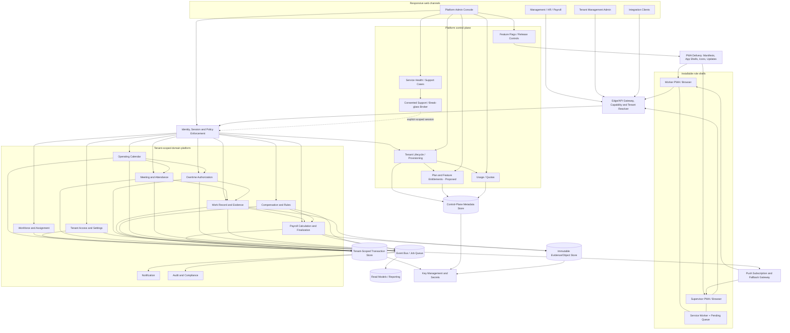

The solid Platform Admin paths terminate in control-plane capabilities. The dotted support-broker path is the only platform-to-tenant mediation path and exists only for an approved, visible, expiring support session. It does not bypass tenant RBAC, field masking, maker-checker rules, or payroll invariants.

### 5.2 SaaS Tenancy and Onboarding Lifecycle

**Confirmed lifecycle concepts**: every tenant has an explicit status, onboarding progress, enabled feature set, quota policy, security baseline, data-isolation placement, and audit history. Provisioning is asynchronous and resumable. Product behavior must distinguish platform suspension from tenant-configured business closure and from individual account disablement.

**Design proposal**:

```pascal
ENUM TenantStatus
  REQUESTED
  PROVISIONING
  ONBOARDING
  ACTIVE
  RESTRICTED
  SUSPENDED
  TERMINATION_PENDING
  TERMINATED
END ENUM

STRUCTURE TenantEntitlementSnapshot
  tenant_id: UUID
  plan_code: Optional<String>
  feature_keys: Set<String>
  quota_limits: Map<String, NonNegativeInteger>
  effective_at: Instant
  expires_at: Optional<Instant>
  source_version: PositiveInteger
  digest: Hash
END STRUCTURE

PROCEDURE PROVISION_TENANT(request, platform_operator)
  REQUIRE authorize_platform(platform_operator, PROVISION_TENANT, request) = ALLOW
  REQUIRE request.idempotency_key IS valid

  tenant <- GET_OR_CREATE tenant_by_idempotency_key(request.idempotency_key)
  FOR EACH provisioning_step IN ordered_provisioning_plan(tenant) DO
    ASSERT every completed step is idempotent and recorded
    IF provisioning_step NOT completed THEN
      execute_step(provisioning_step)
      record_step_completion(tenant.id, provisioning_step)
    END IF
  END FOR

  tenant.status <- ONBOARDING
  APPEND audit_event("TENANT_PROVISIONED", tenant.control_plane_digest)
  RETURN tenant
END PROCEDURE
```

**Preconditions**: authorized platform operation; unique customer/tenant request; requested placement and baseline are valid.

**Postconditions**: retries converge on one tenant; no tenant becomes Active before mandatory identity, security, ownership, data-placement, and onboarding checks pass; tenant payroll data is not created or inspected by the platform operator.

**Loop invariants**: completed provisioning steps remain recorded and safe under retry; each resource belongs to the same tenant placement; failure leaves a diagnosable resumable state.

Status enforcement is command-sensitive: for example, `SUSPENDED` normally blocks tenant mutations and new sessions while preserving data and configurable worker access to already-published payslips where contractual/security policy allows. Exact restricted/suspended behavior, grace periods, data export, and termination retention remain open. Entitlement evaluation records the snapshot version used and must never remove access to legally/contractually required retained records without an approved lifecycle policy.

### 5.3 Deployment Proposal

Start with independently testable bounded modules in one transactional deployment plus asynchronous workers. This reduces distributed consistency risk in work-to-payroll invariants. Publish domain events through a transactional outbox. Extract high-volume modules—notifications, evidence validation, calculation workers, exports—only when measured scale warrants it.

Tenant isolation choices must be selected at implementation:

- **Baseline proposal**: shared database with mandatory `tenant_id`, database row-level controls where supported, tenant-aware repository APIs, per-tenant encryption context, and automated cross-tenant property tests.
- **Higher-isolation option**: dedicated schema/database and encryption keys for regulated or enterprise tiers.
- Every cache key, object key, search index, message, idempotency key, metric label policy, and export is tenant scoped.
- No caller-supplied tenant ID is trusted without deriving and comparing it to the authenticated principal and resource.

## 6. Bounded Contexts and Responsibilities

| Context | Responsibilities | Owns authoritative data |
|---|---|---|
| Platform Control Plane | tenant lifecycle/provisioning/status, proposed plans/entitlements, usage/quotas, platform defaults, flags/releases, service health and support cases | control-plane tenant metadata; never tenant payroll payloads |
| Support Access Broker | tenant-approved support sessions, exceptional break-glass grants, expiry/revocation and dual attribution | immutable support grant/session evidence |
| Tenant & Access | tenant settings, users, roles, permission sets, SoD policies, service principals | role/permission/policy versions |
| PWA Delivery & Device Sessions | role manifests/start URLs, app-shell releases, installation/session metadata, capability state, push subscriptions, update policy and revocation | minimized device/session/push metadata; no authoritative work/payroll state |
| Workforce | worker profile, employment identity, site/team/supervisor assignments | effective-dated worker assignments |
| Operating Calendar | monthly draft, approval, publication, Working/Closed dates | immutable published calendar versions |
| Meeting & Attendance | toolbox meetings, roster snapshot, attendance calls, worker arrival confirmation | meeting and attendance state |
| Overtime Authorization | proposals, assignment scope, approvals, pre-work consent | OT plan/assignment/consent state |
| Work Record & Evidence | draft/verified/acknowledged records, segments, QR evidence, disputes | verified work ledger and record versions |
| Compensation & Rules | compensation profiles, pay/OT rules, allowances, incentive/deduction definitions | approved effective-dated versions |
| Payroll | projections, calculations, review, adjustments, readiness, snapshots, payslips | calculation runs, monthly ledger, immutable snapshots |
| Notification | templates, preferences, delivery and escalation | delivery state, not domain truth |
| Audit & Compliance | append-only command/approval/signature/access evidence and exports | audit events and integrity anchors |
| Reporting & Integration | read models, exports, inbound/outbound contracts | derived data only |

No context may directly mutate another context’s authoritative data. Synchronous commands or transactional module APIs enforce invariants; events update derived views.

## 7. Domain Model

### 7.1 Entity Relationship Diagram

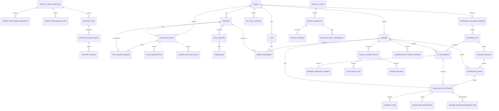

### 7.2 Core Data Structures

```pascal
STRUCTURE TenantScopedId
  tenant_id: UUID
  entity_id: UUID
END STRUCTURE

STRUCTURE TenantControlRecord
  tenant_id: UUID
  status: TenantStatus
  onboarding_stage: String
  entitlement_snapshot_id: UUID
  quota_policy_version: UUID
  security_baseline_version: UUID
  data_placement: String
  version: PositiveInteger
END STRUCTURE

ENUM ClientCapability
  INSTALLATION
  PUSH
  BACKGROUND_SYNC
  CAMERA
  GEOLOCATION
  DURABLE_STORAGE
END ENUM

ENUM AppUpdateState
  CURRENT
  UPDATE_AVAILABLE
  ACTIVATION_DEFERRED
  RELOAD_REQUIRED
  SECURITY_UPDATE_REQUIRED
END ENUM

STRUCTURE AppInstallation
  id: TenantScopedId
  principal_id: PrincipalId
  role_shell: WORKER | SUPERVISOR
  manifest_version: String
  app_release_version: String
  display_mode: BROWSER | STANDALONE
  capabilities: Map<ClientCapability, AVAILABLE | DENIED | UNAVAILABLE>
  update_state: AppUpdateState
  push_subscription_ref: Optional<EncryptedReference>
  last_seen_at: Instant
  revoked_at: Optional<Instant>
END STRUCTURE

STRUCTURE PwaSessionBinding
  id: TenantScopedId
  installation_id: UUID
  server_session_ref: Hash
  principal_id: PrincipalId
  authorized_role_shells: NonEmptySet<WORKER | SUPERVISOR>
  authenticated_at: Instant
  fresh_auth_until: Instant
  expires_at: Instant
  revoked_at: Optional<Instant>
END STRUCTURE

STRUCTURE PushSubscription
  id: TenantScopedId
  installation_id: UUID
  endpoint_ref: EncryptedReference
  provider_key_version: String
  consented_at: Instant
  expires_at: Optional<Instant>
  revoked_at: Optional<Instant>
END STRUCTURE

STRUCTURE PendingOfflineAction
  local_action_id: UUID
  tenant_id: UUID
  principal_id: PrincipalId
  session_binding: Hash
  action_type: String
  action_digest: Hash
  minimized_encrypted_payload: Bytes
  expected_server_version: Optional<PositiveInteger>
  created_at: Instant
  expires_at: Instant
  status: PENDING | SUBMITTING | SERVER_ACCEPTED | SERVER_REJECTED | CONFLICT | EXPIRED
  retry_count: NonNegativeInteger
END STRUCTURE

STRUCTURE EffectiveInterval
  starts_at: Instant
  ends_at: Optional<Instant>
END STRUCTURE

STRUCTURE VersionMetadata
  version: PositiveInteger
  previous_version_id: Optional<UUID>
  created_at: Instant
  created_by: PrincipalId
  reason_code: String
  content_digest: Hash
END STRUCTURE

ENUM CalendarDayKind
  WORKING
  CLOSED
END ENUM

STRUCTURE CalendarDay
  id: TenantScopedId
  local_date: Date
  site_scope: Set<SiteId>
  kind: CalendarDayKind
  calendar_version_id: UUID
  publication_status: DRAFT | PENDING_APPROVAL | PUBLISHED | SUPERSEDED
END STRUCTURE

STRUCTURE AuthorizedWorkWindow
  date: Date
  starts_at: ZonedDateTime
  ends_at: ZonedDateTime
  site_id: SiteId
  location_scope: GeoOrCheckpointScope
  supervisor_ids: NonEmptySet<PrincipalId>
  worker_ids: NonEmptySet<WorkerId>
  work_type: WORKING_DAY_OT | CLOSED_DAY_OT | EMERGENCY
  authorization_version_id: UUID
END STRUCTURE

STRUCTURE TimeSegment
  start: ZonedDateTime
  end: ZonedDateTime
  break_minutes: NonNegativeInteger
  classification: NORMAL | OT_CATEGORY | UNPAID | EXCLUDED
  source: MEETING | QR | SUPERVISOR_EDIT | APPROVED_EXCEPTION
END STRUCTURE

STRUCTURE WorkRecordVersion
  id: TenantScopedId
  worker_id: WorkerId
  work_date: Date
  site_id: SiteId
  calendar_day_id: UUID
  authorization_id: Optional<UUID>
  status: WorkRecordStatus
  segments: List<TimeSegment>
  remark_code: Optional<String>
  remark_text: Optional<String>
  evidence_refs: Set<EvidenceId>
  supervisor_verification_id: Optional<UUID>
  supersedes: Optional<UUID>
  metadata: VersionMetadata
END STRUCTURE

STRUCTURE WorkerAcknowledgementItem
  work_record_id: UUID
  reviewed_version: PositiveInteger
  reviewed_digest: Hash
  decision: ACKNOWLEDGE | DISPUTE
  dispute_reason: Optional<String>
  signed_at: Instant
  signer_id: WorkerId
  batch_envelope_id: Optional<UUID>
END STRUCTURE

STRUCTURE CompensationProfileVersion
  id: TenantScopedId
  worker_id: WorkerId
  effective_interval: EffectiveInterval
  pay_basis: MONTHLY | DAILY | HOURLY | OTHER_CONFIGURED
  basic_salary: Money
  standard_days: Decimal
  standard_hours: Decimal
  currency: CurrencyCode
  overtime_rule_refs: List<RuleVersionId>
  allowance_rule_refs: List<RuleVersionId>
  incentive_rule_refs: List<RuleVersionId>
  deduction_rule_refs: List<RuleVersionId>
  approval_status: DRAFT | PENDING_APPROVAL | APPROVED | REJECTED | SUPERSEDED
  metadata: VersionMetadata
END STRUCTURE

STRUCTURE CalculationProvenance
  calculation_engine_version: String
  rule_version_ids: Set<UUID>
  calendar_version_ids: Set<UUID>
  compensation_version_ids: Set<UUID>
  work_record_version_ids: Set<UUID>
  adjustment_version_ids: Set<UUID>
  input_digest: Hash
  result_digest: Hash
  calculated_at: Instant
END STRUCTURE

STRUCTURE PayrollSnapshot
  id: TenantScopedId
  payroll_period_id: UUID
  snapshot_version: PositiveInteger
  status: FINALIZED | PUBLISHED
  worker_result_refs: NonEmptyList<ImmutableResultRef>
  locked_input_refs: NonEmptySet<SnapshotInputReference>
  finalized_by: PrincipalId
  finalized_at: Instant
  approval_evidence_ref: UUID
  snapshot_digest: Hash
END STRUCTURE
```

### 7.3 Validation Rules

- All IDs are tenant-scoped and all references must resolve within the same tenant.
- Date/time calculations use the site’s configured IANA time zone; stored instants retain the resolved zone and offset.
- A time segment must have `end > start`, non-negative breaks, and payable duration not below zero.
- Work segments for the same worker must not overlap unless a tenant policy explicitly models concurrent assignments; the default is hard rejection.
- A Closed-day work record must reference an approved authorization covering worker, supervisor, site/location, date, and actual time.
- A Worker Pre-Work Consent must be signed before the authorized window starts and bind to the authorization digest.
- Approved compensation intervals for the same worker/pay basis cannot ambiguously overlap.
- Every approval and acknowledgement binds to a content digest and version.
- Monetary values use fixed-precision decimal arithmetic and explicit currency; no binary floating point.
- Published/finalized objects are immutable; corrections create new versions where the current scope permits them.
- An app installation, PWA session binding, role-shell switch, or push subscription is never an authorization grant; every request revalidates current identity, tenant status, role, scope, session, and resource version.
- A PWA session binding must reference the same tenant, principal, and installation as the authenticated server session; it expires no later than that server session and is revoked on logout, account/session revocation, role loss, tenant suspension, or device revocation.
- Pending offline actions are non-authoritative and cannot advance server state until authenticated validation succeeds; queue status must be visible to the user.
- Device-local payloads are minimized, encrypted where platform capability permits, bound to tenant/principal/session, expire by policy, and are purged on logout, session revocation, role loss, tenant suspension, or remote wipe signal.
- Salary, payslip files, high-sensitivity evidence, authentication secrets, and complete worker rosters are excluded from general-purpose service-worker caches.

## 8. State Machines

### 8.1 Operating Calendar

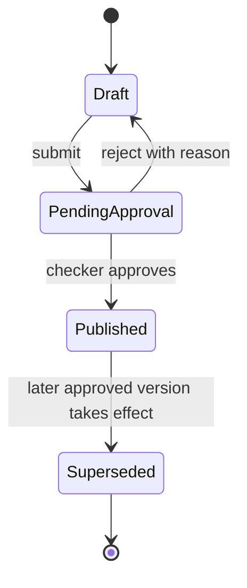

A published version is immutable. A replacement version must run impact analysis. If the replacement affects existing meetings, work, OT, or payroll, policy determines whether publication is blocked or requires elevated approval; silent reinterpretation is forbidden.

### 8.2 Ordinary Work Record

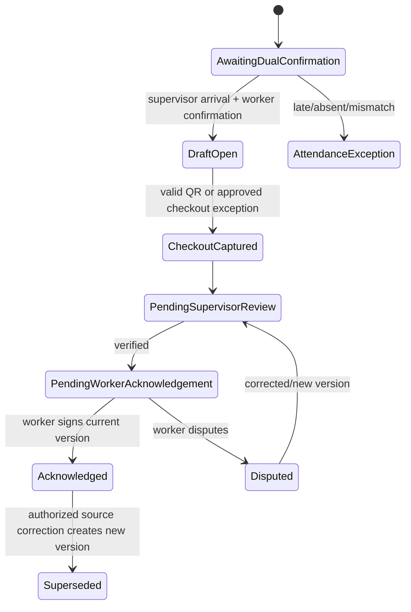

### 8.3 Overtime Assignment

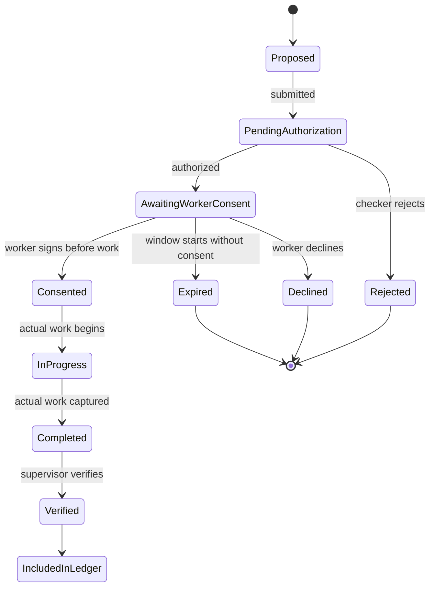

Working-day and Closed-day OT use the same lifecycle but different eligibility guards and display labels. Closed-day records always retain the Closed calendar classification.

### 8.4 Payroll Ledger Entry

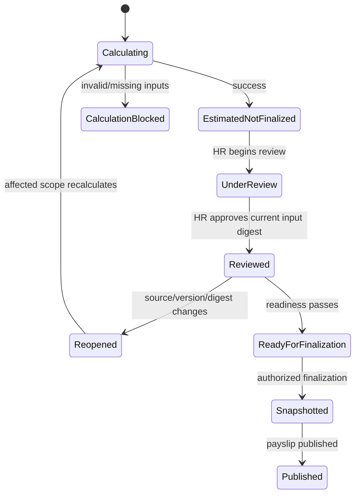

### 8.5 PWA Installation and Release State

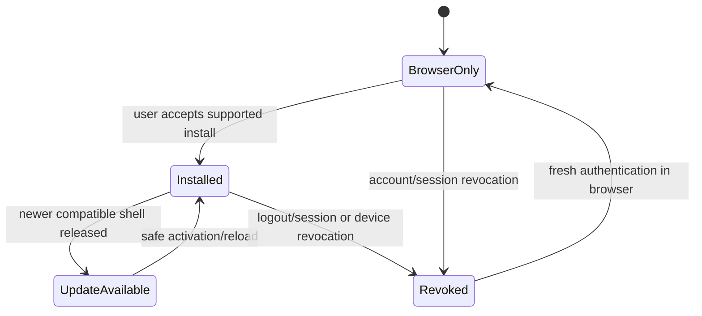

Installation state never changes authorization. A service-worker release is signed/versioned through the deployment trust chain, uses controlled rollout and rollback, and cannot activate over an in-progress sensitive action without safe state handling. Security-critical revocation clears session-bound state regardless of display mode.

## 9. Key End-to-End Sequences

### 9.1 Normal Work on a Working Day

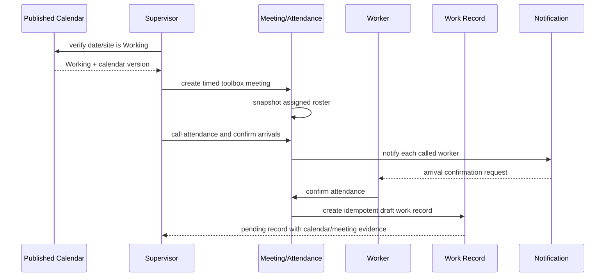

```pascal
PROCEDURE CREATE_ORDINARY_WORK_DRAFT(meeting, worker, supervisor_confirmation, worker_confirmation)
  REQUIRE meeting.calendar_day.kind = WORKING
  REQUIRE meeting.status = ACTIVE
  REQUIRE worker IN meeting.roster_snapshot
  REQUIRE supervisor_confirmation IS valid
  REQUIRE worker_confirmation IS valid
  REQUIRE both confirmations refer to meeting.id AND worker.id

  idempotency_key <- HASH(meeting.id, worker.id, "ORDINARY_DRAFT")

  IF work_record_exists(idempotency_key) THEN
    RETURN existing_work_record(idempotency_key)
  END IF

  draft <- new_work_record(
    worker = worker,
    date = meeting.local_date,
    start = confirmed_arrival_policy_time(supervisor_confirmation, worker_confirmation),
    calendar_version = meeting.calendar_version,
    status = DRAFT_OPEN)

  APPEND audit_event("WORK_DRAFT_CREATED", draft.digest)
  RETURN draft
END PROCEDURE
```

**Preconditions**: current published day is Working; meeting is created manually by an assigned supervisor; both confirmations are authentic and scoped.

**Postconditions**: exactly one draft exists for the meeting-worker pair; source versions and both confirmations are recorded; no payroll value is finalized.

**Loop invariants**: not applicable.

### 9.2 Planned OT on a Working Day

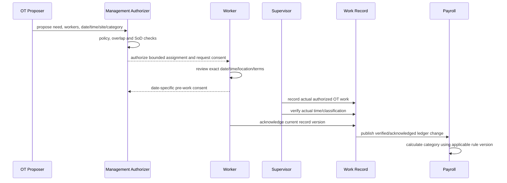

Ordinary work authorization comes from the Working calendar. Planned OT is never inferred solely from hours beyond a threshold; it must link to an authorized assignment or enter an explicit exception workflow.

### 9.3 Closed-Day Authorized OT

```mermaid
sequenceDiagram
    participant C as Published Calendar
    participant S as Supervisor/Proposer
    participant A as Management Checker
    participant W as Named Worker
    participant M as Special Meeting
    participant R as Work Record

    C-->>S: Closed
    S->>A: propose named workers, supervisor, time, site/location, purpose
    A->>A: risk and maker-checker checks
    A-->>W: approve scope; request pre-work consent
    W->>A: sign assignment digest before start
    S->>M: create special meeting within authorized scope
    M->>C: preserve Closed classification
    M->>R: create special work draft
    R->>R: enforce scope/time/location and label
    R-->>W: Closed — Authorized OT Work
```

```pascal
PROCEDURE AUTHORIZE_CLOSED_DAY_WORK(proposal, checker)
  REQUIRE published_day(proposal.date, proposal.site).kind = CLOSED
  REQUIRE proposal.worker_ids IS NOT EMPTY
  REQUIRE proposal.supervisor_ids IS NOT EMPTY
  REQUIRE proposal.time_window IS bounded
  REQUIRE proposal.location_scope IS bounded
  REQUIRE checker.id != proposal.created_by
  REQUIRE authorize_command(checker, APPROVE_CLOSED_DAY_OT, proposal) = ALLOW
  REQUIRE no_invalid_overlap(proposal)

  authorization <- immutable_authorization_from(proposal)
  authorization.label <- "Closed — Authorized OT Work"
  authorization.digest <- HASH(canonicalize(authorization))

  FOR EACH worker_id IN authorization.worker_ids DO
    CREATE consent_request(worker_id, authorization.digest, authorization.starts_at)
    ASSERT calendar_day(authorization.date).kind = CLOSED
  END FOR

  APPEND audit_event("CLOSED_DAY_OT_AUTHORIZED", authorization.digest)
  RETURN authorization
END PROCEDURE
```

**Preconditions**: date remains Closed; maker and checker differ where required; proposal is named and bounded.

**Postconditions**: immutable authorization and per-worker consent requests exist; no worker is considered consented automatically; calendar remains Closed.

**Loop invariants**: each created consent request binds to the same authorization digest; the published calendar remains Closed after every iteration.

### 9.4 QR Checkout, Supervisor Edit, and Worker Confirmation

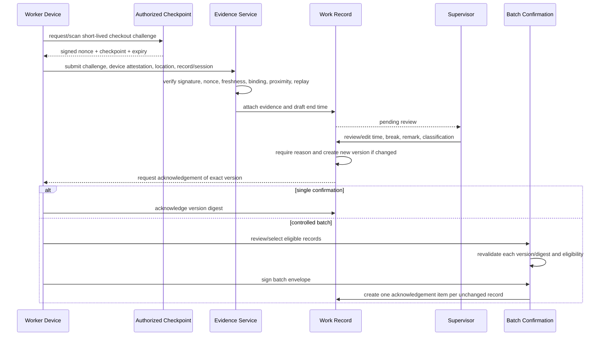

```pascal
PROCEDURE VALIDATE_QR_CHECKOUT(submission, now)
  REQUIRE submission.tenant_id = authenticated_tenant()
  REQUIRE submission.worker_id = authenticated_worker()

  IF NOT verify_checkpoint_signature(submission.challenge) THEN
    RETURN REJECT("Invalid challenge signature")
  END IF

  IF submission.challenge.purpose != CHECKOUT THEN
    RETURN REJECT("Wrong challenge purpose")
  END IF

  IF now > submission.challenge.expires_at THEN
    RETURN REJECT("Expired challenge")
  END IF

  IF nonce_already_consumed(submission.challenge.nonce) THEN
    RETURN REJECT("Replay detected")
  END IF

  IF NOT challenge_matches_record_site_and_session(submission) THEN
    RETURN REJECT("Scope mismatch")
  END IF

  IF NOT location_evidence_satisfies_policy(submission.location, submission.challenge.checkpoint) THEN
    RETURN ROUTE_TO_EXCEPTION("Location mismatch")
  END IF

  ATOMICALLY
    consume_nonce(submission.challenge.nonce)
    store_minimized_evidence(submission)
    set_draft_end_time(submission.work_record_id, trusted_receipt_time(now))
  END ATOMICALLY

  RETURN ACCEPT
END PROCEDURE
```

**Preconditions**: authenticated worker has an open record; challenge originates from an authorized checkpoint.

**Postconditions**: challenge is consumed at most once; accepted evidence is attached to the correct record; rejection does not set an end time; exception routes are explicit.

**Loop invariants**: not applicable.

```pascal
PROCEDURE ACKNOWLEDGE_BATCH(worker, selected_items, signed_envelope)
  REQUIRE selected_items IS NOT EMPTY
  REQUIRE signed_envelope.worker_id = worker.id
  REQUIRE signed_envelope.item_digests = DIGEST_LIST(selected_items)

  acknowledgements <- EMPTY LIST
  exclusions <- EMPTY LIST

  FOR EACH selected IN selected_items DO
    current <- load_current_work_record(selected.work_record_id)

    ASSERT every item already processed is either acknowledged exactly once OR excluded with reason

    IF current.worker_id != worker.id THEN
      ADD (selected.id, "NOT_OWNER") TO exclusions
    ELSE IF current.status != PENDING_WORKER_ACKNOWLEDGEMENT THEN
      ADD (selected.id, "INELIGIBLE_STATE") TO exclusions
    ELSE IF current.version != selected.reviewed_version OR current.digest != selected.reviewed_digest THEN
      ADD (selected.id, "CHANGED_SINCE_REVIEW") TO exclusions
    ELSE IF current.has_unresolved_dispute OR current.has_blocking_exception THEN
      ADD (selected.id, "UNRESOLVED") TO exclusions
    ELSE
      ADD create_per_record_acknowledgement(worker, current, signed_envelope.id) TO acknowledgements
    END IF
  END FOR

  COMMIT acknowledgements idempotently
  RETURN BatchResult(acknowledgements, exclusions)
END PROCEDURE
```

**Preconditions**: worker reviewed each selected record version; envelope binds ordered item digests.

**Postconditions**: only current eligible records are acknowledged; every acknowledgement remains independently traceable; changed/unresolved records are excluded, not silently signed; retry does not duplicate acknowledgement.

**Loop invariants**: processed items are partitioned into exactly one of acknowledged or excluded; no item owned by another worker is acknowledged; all acknowledgement digests equal current record digests.

### 9.5 Monthly Payroll Review and Finalization

```mermaid
sequenceDiagram
    participant L as Verified Work Ledger
    participant C as Compensation/Rules
    participant E as Calculation Engine
    participant H as HR/Payroll Reviewer
    participant F as Finalizer
    participant S as Snapshot Store
    participant W as Worker Panel

    L->>E: work record version events
    C->>E: approved effective version events
    E->>E: recompute affected worker/period idempotently
    E-->>H: Estimated / Not Finalized monthly ledger
    H->>H: drill into days, evidence, rules, versions, exceptions
    H->>E: add approved reason-coded adjustment or compensation version
    E-->>H: before/after impact and recalculation
    H->>H: approve current input digest
    Note over L,C,H: any source change reopens affected review
    F->>E: run readiness checks
    E-->>F: ready + exact input/result digests
    F->>S: create immutable snapshot and lock references
    S-->>W: publish versioned payslip
```

```pascal
PROCEDURE CALCULATE_WORKER_PERIOD(worker_id, payroll_period_id, trigger)
  inputs <- resolve_applicable_inputs(worker_id, payroll_period_id)
  REQUIRE inputs.currency IS unambiguous
  REQUIRE inputs.compensation_versions cover required dates
  REQUIRE inputs.calendar_versions ARE published

  canonical_input <- canonicalize(inputs)
  input_digest <- HASH(canonical_input)
  idempotency_key <- HASH(worker_id, payroll_period_id, input_digest, ENGINE_VERSION)

  IF successful_result_exists(idempotency_key) THEN
    RETURN existing_result(idempotency_key)
  END IF

  lines <- EMPTY LIST
  FOR EACH work_record IN inputs.eligible_work_records ORDERED BY date, id DO
    ASSERT all earlier lines reference exact source and rule versions
    applicable_rules <- resolve_rules_for(work_record, inputs)
    ADD evaluate_record(work_record, applicable_rules, inputs.compensation) TO lines
  END FOR

  ADD evaluate_period_allowances_incentives_deductions(inputs, lines) TO lines
  result <- aggregate_fixed_precision(lines)
  provenance <- build_provenance(inputs, input_digest, result)

  STORE result, lines, provenance ATOMICALLY
  mark_prior_review_stale_if_digest_changed(worker_id, payroll_period_id, input_digest)
  RETURN result WITH status ESTIMATED_NOT_FINALIZED
END PROCEDURE
```

**Preconditions**: all mandatory applicable versions are resolvable; input units/currencies are valid.

**Postconditions**: same canonical inputs and engine version produce the same result; every line is traceable; changed digest reopens affected review; output remains estimated.

**Loop invariants**: accumulated lines are deterministic, fixed precision, and reference only applicable approved versions; no source record is counted more than once.

```pascal
PROCEDURE FINALIZE_PAYROLL_PERIOD(period, finalizer)
  REQUIRE authorize_command(finalizer, FINALIZE_PAYROLL, period) = ALLOW
  REQUIRE finalizer satisfies maker_checker_policy(period)

  readiness <- run_readiness_checks(period)
  IF readiness.has_blockers THEN
    RETURN BLOCKED(readiness.blockers)
  END IF

  lock_token <- acquire_period_finalization_lock(period.id)
  TRY
    current_inputs <- reload_all_finalization_inputs(period)
    REQUIRE current_inputs.digest = readiness.checked_input_digest
    REQUIRE all_worker_results_are_reviewed_at_current_digest(current_inputs)

    snapshot <- create_immutable_snapshot(current_inputs)
    FOR EACH worker_result IN snapshot.worker_results DO
      ASSERT worker_result.input_digest = current_review_digest(worker_result.worker_id)
      lock_input_references(worker_result.provenance)
      create_versioned_payslip(worker_result, snapshot.id)
    END FOR

    APPEND audit_event("PAYROLL_FINALIZED", snapshot.digest)
    publish_payslips(snapshot.id)
    RETURN snapshot
  FINALLY
    release_lock(lock_token)
  END TRY
END PROCEDURE
```

**Preconditions**: authorized checker, no readiness blockers, current reviews match current inputs.

**Postconditions**: one immutable snapshot version is created; included references are locked; each included worker has a versioned payslip; partial finalization is rolled back.

**Loop invariants**: every processed worker result matches its reviewed digest and snapshot; locked references remain unchanged; one payslip is created per included worker per snapshot version.

## 10. Component Interfaces

All interfaces are conceptual and language-agnostic. Commands require tenant context, actor context, idempotency key, expected version where mutable, and correlation ID.

```pascal
INTERFACE PlatformControlService
  PROCEDURE request_tenant(onboarding_request, idempotency_key) RETURNS TenantControlRecord
  PROCEDURE provision_tenant(request_id, expected_version) RETURNS ProvisioningProgress
  PROCEDURE change_tenant_status(tenant_id, transition, reason, expected_version) RETURNS TenantControlRecord
  PROCEDURE set_entitlement_snapshot(tenant_id, proposal, checker, expected_version) RETURNS TenantEntitlementSnapshot
  PROCEDURE get_usage_and_quota(tenant_id) RETURNS UsageQuotaView
  PROCEDURE set_feature_release(feature_key, audience, rollout_policy, checker) RETURNS FeatureRelease
END INTERFACE

INTERFACE SupportAccessService
  PROCEDURE request_session(case_id, requested_scope, purpose, duration) RETURNS SupportAccessRequest
  PROCEDURE approve_session(tenant_approver, request_id, approved_scope, expires_at) RETURNS SupportGrant
  PROCEDURE start_session(platform_agent, grant_id) RETURNS SupportSession
  PROCEDURE revoke_session(tenant_or_platform_authorizer, session_id, reason) RETURNS Revocation
  PROCEDURE start_break_glass(case_id, emergency_reason, dual_approval) RETURNS SupportSession
END INTERFACE

INTERFACE PwaDeliveryService
  PROCEDURE get_manifest(role_shell, tenant_branding_context) RETURNS WebAppManifest
  PROCEDURE register_installation(principal, role_shell, capability_report) RETURNS AppInstallation
  PROCEDURE bind_session(installation_id, authenticated_session, authorized_role_shells) RETURNS PwaSessionBinding
  PROCEDURE switch_role_shell(session_binding_id, target_role_shell) RETURNS PwaSessionBinding
  PROCEDURE register_push_subscription(installation_id, encrypted_subscription) RETURNS PushRegistration
  PROCEDURE rotate_push_subscription(installation_id, prior_subscription_id, encrypted_subscription) RETURNS PushRegistration
  PROCEDURE report_update_state(installation_id, release_version, update_state) RETURNS AppUpdateDecision
  PROCEDURE get_update_policy(role_shell, current_release) RETURNS AppUpdateDecision
  PROCEDURE revoke_session_binding(session_binding_id, reason) RETURNS Revocation
  PROCEDURE revoke_installation(installation_id, reason) RETURNS Revocation
END INTERFACE

INTERFACE OfflineActionService
  PROCEDURE submit_pending_action(actor, local_action_id, action_digest, payload, expected_version) RETURNS ReconciliationResult
  PROCEDURE get_reconciliation_status(actor, local_action_ids) RETURNS List<ReconciliationResult>
END INTERFACE

INTERFACE TenantAccessService
  PROCEDURE evaluate(actor, action, resource, context) RETURNS AuthorizationDecision
  PROCEDURE assign_role(principal_id, role_version_id, scope, expected_version) RETURNS Assignment
  PROCEDURE approve_high_risk_assignment(assignment_id, checker, expected_version) RETURNS Assignment
END INTERFACE

INTERFACE CalendarService
  PROCEDURE create_month(tenant_id, site_scope, year_month) RETURNS CalendarDraft
  PROCEDURE set_day(calendar_id, date, WORKING_OR_CLOSED, expected_version) RETURNS CalendarDraft
  PROCEDURE submit(calendar_id, maker) RETURNS CalendarVersion
  PROCEDURE publish(calendar_id, checker, expected_digest) RETURNS PublishedCalendarVersion
  PROCEDURE get_effective_day(site_id, date) RETURNS CalendarDay
END INTERFACE

INTERFACE MeetingAttendanceService
  PROCEDURE create_working_day_meeting(supervisor, site, date, time) RETURNS ToolboxMeeting
  PROCEDURE create_authorized_closed_day_meeting(supervisor, authorization_id, time) RETURNS ToolboxMeeting
  PROCEDURE confirm_arrival(supervisor, meeting_id, worker_id) RETURNS AttendanceEntry
  PROCEDURE worker_confirm(worker, attendance_id) RETURNS AttendanceEntry
END INTERFACE

INTERFACE OvertimeService
  PROCEDURE propose(proposer, overtime_scope) RETURNS OvertimePlan
  PROCEDURE authorize(checker, plan_id, expected_digest) RETURNS OvertimeAuthorization
  PROCEDURE consent(worker, assignment_id, assignment_digest) RETURNS WorkerPreWorkConsent
  PROCEDURE decline(worker, assignment_id, reason) RETURNS ConsentDecision
END INTERFACE

INTERFACE WorkRecordService
  PROCEDURE create_from_dual_confirmation(attendance_id, idempotency_key) RETURNS WorkRecordVersion
  PROCEDURE submit_checkout(evidence_submission, idempotency_key) RETURNS CheckoutResult
  PROCEDURE request_exception(worker_or_supervisor, type, evidence) RETURNS WorkRecordException
  PROCEDURE verify(supervisor, record_id, edits, reason, expected_version) RETURNS WorkRecordVersion
  PROCEDURE acknowledge(worker, record_id, version, digest) RETURNS WorkerAcknowledgementItem
  PROCEDURE acknowledge_batch(worker, reviewed_items, signed_envelope) RETURNS BatchResult
  PROCEDURE dispute(worker, record_id, version, reason) RETURNS Dispute
END INTERFACE

INTERFACE CompensationService
  PROCEDURE draft_profile(payroll_maker, worker_id, values, effective_interval, reason) RETURNS ProfileVersion
  PROCEDURE approve_profile(checker, profile_id, expected_digest) RETURNS ApprovedProfileVersion
  PROCEDURE resolve(worker_id, instant_or_date) RETURNS ApprovedProfileVersion
  PROCEDURE create_adjustment(maker, worker_id, period, amount_or_formula, reason) RETURNS AdjustmentVersion
END INTERFACE

INTERFACE PayrollService
  PROCEDURE calculate(worker_id, period_id, trigger) RETURNS CalculationResult
  PROCEDURE calculate_affected(change_event) RETURNS RecalculationSummary
  PROCEDURE review(reviewer, ledger_entry_id, current_input_digest, decision) RETURNS ReviewDecision
  PROCEDURE readiness(period_id) RETURNS ReadinessReport
  PROCEDURE finalize(finalizer, period_id, checked_digest) RETURNS PayrollSnapshot
  PROCEDURE publish(snapshot_id) RETURNS PublicationResult
END INTERFACE
```

### 10.1 Interface Contract Rules

- Every write supports an idempotency key and returns the existing equivalent result on safe retry.
- Mutable aggregate writes require `expected_version`; mismatch returns a conflict with current summary.
- Approval commands bind the checker to the exact submitted digest.
- List and export operations enforce field-level and row-level authorization after tenant scoping.
- API errors use stable codes, human-safe messages, correlation IDs, and no cross-tenant existence disclosure.

## 11. Conceptual API Surface

| Method | Route | Purpose | Key guard |
|---|---|---|---|
| `POST` | `/platform/v1/tenants` | request/provision tenant idempotently | platform control-plane permission; no tenant payroll payload |
| `POST` | `/platform/v1/tenants/{id}/status-transitions` | restrict/suspend/reactivate lifecycle | reason, expected version, checker policy |
| `PUT` | `/platform/v1/tenants/{id}/entitlements` | version feature/quota proposal | billing scope open; checker and impact preview |
| `POST` | `/platform/v1/support-cases/{id}/session-requests` | request tenant-scoped support access | purpose/scope/duration; tenant approval required |
| `POST` | `/tenant/v1/support-session-requests/{id}/approve` | approve bounded support session | authorized tenant approver; exact digest |
| `DELETE` | `/v1/support-sessions/{id}` | revoke active support session | tenant or platform security authority |
| `GET` | `/pwa/{role}/manifest.webmanifest` | role-specific install metadata | Worker/Supervisor shell and authorized branding |
| `POST` | `/v1/app-installations` | register role shell/capabilities | current authenticated session; minimized metadata |
| `POST` | `/v1/app-installations/{id}/push-subscription` | register/rotate push endpoint | encrypted endpoint; ownership and revocation checks |
| `POST` | `/v1/offline-actions/reconcile` | idempotently validate pending device actions | current auth, action digest, version and policy checks |
| `POST` | `/v1/calendars` | create monthly calendar draft | calendar maker scope |
| `POST` | `/v1/calendars/{id}/submit` | submit exact version | expected digest |
| `POST` | `/v1/calendars/{id}/publish` | checker publication | SoD and impact report |
| `POST` | `/v1/meetings` | create ordinary or authorized special meeting | calendar/authorization guard |
| `POST` | `/v1/meetings/{id}/attendance/{workerId}/supervisor-confirmation` | confirm arrival | roster scope |
| `POST` | `/v1/attendance/{id}/worker-confirmation` | worker confirmation | ownership |
| `POST` | `/v1/overtime-plans` | propose planned OT | scoped proposer |
| `POST` | `/v1/overtime-plans/{id}/authorize` | authorize submitted digest | checker policy |
| `POST` | `/v1/overtime-assignments/{id}/consent` | date-specific consent | before-work + digest |
| `POST` | `/v1/work-records/{id}/checkout` | submit QR/evidence | one-time challenge |
| `POST` | `/v1/work-records/{id}/verify` | supervisor verify/edit | expected version + reason |
| `POST` | `/v1/work-records/{id}/acknowledge` | worker single acknowledgement | exact version/digest |
| `POST` | `/v1/work-record-acknowledgement-batches` | safe batch acknowledgement | per-item revalidation |
| `POST` | `/v1/work-records/{id}/disputes` | dispute individual date | ownership/current version |
| `POST` | `/v1/compensation-profiles` | draft effective profile | salary edit permission |
| `POST` | `/v1/compensation-profiles/{id}/approve` | approve profile | maker-checker |
| `GET` | `/v1/payroll-periods/{id}/ledger` | monthly worker ledger | salary/view scope |
| `POST` | `/v1/payroll-ledger/{id}/review` | review current digest | HR/payroll permission |
| `POST` | `/v1/payroll-periods/{id}/readiness` | run readiness | finalizer scope |
| `POST` | `/v1/payroll-periods/{id}/finalize` | immutable snapshot | checker + lock |
| `GET` | `/v1/workers/me/payslips/{id}` | published payslip | worker ownership |

## 12. Domain Events

Events carry event ID, tenant ID, aggregate ID/version, occurred time, actor/correlation/causation IDs, schema version, and minimized payload. Consumers are idempotent by event ID.

- `TenantProvisioningRequested`
- `TenantProvisioningCompleted`
- `TenantStatusChanged`
- `TenantEntitlementSnapshotChanged`
- `TenantQuotaThresholdReached`
- `SupportSessionApproved`
- `SupportSessionStarted`
- `SupportSessionRevoked`
- `BreakGlassAccessUsed`
- `AppInstallationRegistered`
- `PwaSessionBound`
- `PwaRoleShellSwitched`
- `PwaSessionRevoked`
- `PushSubscriptionChanged`
- `AppUpdateStateChanged`
- `AppReleaseActivated`
- `OfflineActionReconciled`
- `OperatingCalendarPublished`
- `ToolboxMeetingCreated`
- `SupervisorArrivalConfirmed`
- `WorkerArrivalConfirmed`
- `WorkRecordDraftCreated`
- `OvertimePlanAuthorized`
- `WorkerPreWorkConsentRecorded`
- `CheckoutEvidenceAccepted`
- `CheckoutExceptionRequested`
- `WorkRecordVerified`
- `WorkRecordAcknowledged`
- `WorkRecordDisputed`
- `WorkRecordVersionSuperseded`
- `CompensationProfileApproved`
- `PayrollAdjustmentApproved`
- `PayrollCalculationCompleted`
- `PayrollReviewReopened`
- `PayrollPeriodReady`
- `PayrollSnapshotFinalized`
- `PayslipPublished`

Events are integration facts, not an unrestricted source of salary data. Sensitive event payloads use references or encrypted restricted topics.

## 13. Versioning, Snapshots, and Provenance

### 13.1 Effective-Dated Records

Workforce assignments, calendars, compensation profiles, pay rules, and selected tenant policies are versioned. Each approved version has an effective interval and immutable content digest. Resolving an applicable version is deterministic for worker, site, work date/time, and payroll period.

A historical payroll calculation never “looks up the latest” configuration. It references exact versions used. New compensation creates a new version with reason and approval; it does not overwrite the previous row.

### 13.2 Work Record Versioning

Supervisor edits create or update a draft version according to workflow state. Once a worker has acknowledged a version or HR has reviewed its calculation digest, any authorized source correction creates a superseding version. Existing acknowledgement remains evidence of what was signed but does not apply to the new version. The new version returns to the required review/acknowledgement state.

### 13.3 Payroll Snapshot

A snapshot stores:

- payroll period and snapshot version;
- exact included workers and calculation result versions;
- work record, compensation, rule, calendar, adjustment, and engine versions;
- readiness report digest and final approval evidence;
- payslip versions and publication state;
- cryptographic digest of canonical snapshot content.

Snapshot immutability is enforced in the domain and storage layer. The future correction extension would reference a prior snapshot and create a new correction/off-cycle artifact; it is not implemented now.

## 14. Payroll Calculation Concepts

### 14.1 Calculation Pipeline

1. Resolve tenant, site, worker, currency, calendar, and payroll period.
2. Select eligible current work-record versions and approved adjustments.
3. Resolve the compensation and rule versions effective for each work date.
4. Validate overlap, duplicate, missing evidence, unresolved dispute, and authorization conditions.
5. Normalize time segments with explicit rounding/break rules from versioned policy.
6. Classify normal and categorized overtime without hard-coded statutory assumptions.
7. Calculate basic/normal pay and categorized OT lines.
8. Add configured incentives and allowances.
9. Apply approved advances/deductions and reason-coded one-off adjustments.
10. Aggregate gross and net using fixed precision.
11. Produce warnings/blockers, line-level explanations, before/after impact, and provenance.
12. Store an idempotent Estimated/Not Finalized result.

### 14.2 Formula Representation Proposal

Rules are constrained declarative expressions rather than arbitrary tenant code. They support typed variables, units, conditions, tables, rounding modes, caps, and effective dates. A validator rejects cycles, ambiguous currency, unsupported references, and non-deterministic functions.

```pascal
STRUCTURE CalculationLine
  line_type: BASIC | NORMAL | OVERTIME | INCENTIVE | ALLOWANCE | ADVANCE | DEDUCTION | ADJUSTMENT
  category_code: String
  quantity: Decimal
  unit: DAY | HOUR | ITEM | FIXED
  rate: MoneyOrMultiplier
  amount: Money
  source_refs: NonEmptySet<VersionedReference>
  rule_version_id: UUID
  explanation_key: String
END STRUCTURE
```

### 14.3 Readiness Checks

Blocking checks include: missing calendar publication, unresolved work disputes, unverified required records, missing/ambiguous compensation, rule evaluation failure, duplicate/overlapping work, missing mandatory OT authorization or consent, stale HR review, unapproved adjustments, currency inconsistency, incomplete maker-checker approvals, and changed input digest since readiness evaluation.

Warning severity is tenant-configurable only where platform and compliance guardrails permit. A tenant cannot downgrade structural corruption, cross-tenant mismatch, stale digest, or failed snapshot integrity.

## 15. Responsive Experience, Design System, and Physical-Card Metaphor

### 15.1 Confirmed Experience Strategy

The product must feel like one high-quality system across Worker, Supervisor, Management/HR/Payroll, Tenant Management Admin, and Platform Admin surfaces while presenting only role-relevant information and actions. Mobile uses progressive disclosure, task cards, bottom/compact navigation where appropriate, and touch-first controls; tablet adapts split panes and grids; desktop supports dense comparison, side-by-side evidence, keyboard efficiency, and complex configuration without making mobile a second-class fallback.

Every surface explicitly designs loading/skeleton, empty, error, partial-data, permission-denied, offline, Pending synchronization, conflict, stale-version, success, and maintenance/suspension states. Optimistic presentation is allowed only for reversible low-risk UI state; attendance, consent, checkout, acknowledgement, approval, compensation, and payroll actions show Pending until server acceptance.

**Accessibility proposal pending target confirmation**: build and test to WCAG 2.2 AA, including semantic landmarks, logical focus order, visible focus, reflow/zoom, reduced motion, sufficient contrast, non-color status cues, error association, accessible authentication, keyboard parity, and touch targets. Accessibility is a release gate, not a post-release enhancement.

### 15.2 Information Architecture and Role Dashboards

| Surface | Primary navigation and dashboard emphasis |
|---|---|
| Worker | Today, Work Records, Overtime/Consent, Notifications, Payslips, Profile/Device |
| Supervisor | Today/Roster, Meetings/Attendance, Exceptions, Work Records, Approvals, Team Status |
| Management/HR/Payroll | Operations, People, Calendar/OT, Work Ledger, Compensation, Payroll, Reports/Exports |
| Tenant Management Admin | Company, Units/Sites/Checkpoints, Accounts/Workers/Assignments, Roles/Policies, Templates, Integrations, Audit/Settings |
| Platform Admin | Tenants/Onboarding, Entitlements/Quotas, Security Defaults, Flags/Releases, Service Health, Support/Audit |

Dashboards are permission-composed rather than merely role-named: a tile, total, action, alert, deep link, and API response appear only when the current principal has the underlying data and action permissions. “Admin” labels do not broaden salary visibility.

### 15.3 Shared Design System and Adaptive Components

**Design proposal**: one versioned design system/codebase supplies semantic tokens for color, type, spacing, density, elevation, motion, breakpoints, focus, status, and data visualization. Shared primitives include app shell, navigation, cards, adaptive grid/table, virtualized list, timeline, calendar, form controls, filters, command/search, status banner, skeleton, empty/error/conflict state, approval summary, evidence drawer, batch review, toast plus persistent task feedback, and accessible chart/table alternatives.

- Grids adapt to column-priority tables, expandable rows, card lists, or detail screens without dropping decision-critical data.
- Forms use responsive grouping, sticky action summaries, autosaved non-sensitive drafts where safe, field and form-level validation, destructive-action confirmation, and explicit unsaved/conflict recovery.
- Charts reflow, preserve legible labels, support touch/keyboard tooltips, and always expose an equivalent table or textual summary.
- Localization readiness includes message keys, plural rules, locale-aware dates/numbers/currency, IANA time-zone display, bidirectional layout readiness, text expansion, and no text baked into imagery.
- Perceived responsiveness uses route/app-shell preloading, skeletons, immediate input feedback, progressive data loading, and background refresh while preserving stale/pending labels.

### 15.4 Monthly Work Card

**Desktop/tablet**:

- One row per calendar date, preserving Date, Start, End, Worker acknowledgement, Supervisor verification, and Remark concepts.
- Added columns or expandable details for status, normal/OT segments, breaks, source, exception, and calculation inclusion.
- Closed rows remain visible, visually distinct, and non-editable for ordinary work.
- Authorized Closed-day rows display “Closed — Authorized OT Work”.
- Sticky monthly totals distinguish verified hours, pending hours, disputed hours, and Estimated/Not Finalized money.
- Evidence drawer shows meeting, attendance, QR, edit, authorization, consent, and audit references according to permission.

**Mobile**:

- Date-list cards with status badge, start/end, total duration, and primary action.
- Detail screen for timeline, evidence, edits, acknowledgement, or dispute.
- Batch selection uses explicit checkboxes, eligibility reason, reviewed version indicator, and final per-date summary before signing.
- Changed records are automatically deselected and marked “Changed since review”.

**Accessibility**:

- Status is expressed by text/icon, not color alone.
- Keyboard navigation and focus management support the monthly grid.
- Screen-reader labels describe date, calendar state, record state, and action.
- Localized dates/numbers/time zones and adequate contrast/touch targets are required.

### 15.5 OT Request Experience

The digital form retains planned date/time rows, worker identity reference, W/P identifier where permitted, pre-work consent, and staggered rest-day acknowledgement where configured. It additionally displays authorization scope, current state, consent deadline, actual-vs-planned comparison, and immutable signature digest. No sample names, identifiers, or signatures are embedded.

### 15.6 Payroll UX

HR sees one monthly ledger listing workers with readiness, review, exception, source-change, and calculation statuses. Drill-down shows daily source records, evidence, exact compensation/rule versions, calculation history, line explanations, and before/after adjustment impact. Workers see live hours/status; current monetary estimates appear only when tenant policy permits and are prominently labeled Estimated/Not Finalized. Published finalized payslips are always visible to the applicable worker.

### 15.7 Confirmed Worker and Supervisor PWA Design

**Recommended design proposal**: Worker and Supervisor are distinct installable manifests and start URLs (`/worker` and `/supervisor`) with role-specific names, icons, shortcuts, navigation, caching policies, and launch destinations, while sharing a frontend platform, design system, security libraries, API client, telemetry, and release pipeline. An authorized person may switch roles through an explicit server-authorized role switch; installing one shell never grants the other role. Separate manifests reduce role confusion and allow safer cache/shortcut scopes without duplicating core code.

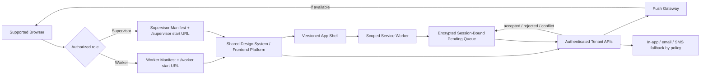

**Worker PWA shell**: attendance confirmation, date-specific OT consent/decline, camera-assisted QR checkout, current hours and status, Work Record single/batch acknowledgement or dispute, notifications, and finalized payslips. Payslip viewing requires fresh authentication according to risk policy and is fetched without general-purpose offline caching.

**Supervisor PWA shell**: assigned roster/toolbox meeting, attendance call, exceptions, work-record review/edit, worker statuses, visible Closed-day authorization limits, and only approvals granted by current permission. Offline roster material is minimized to the active assignment/time window and cannot expose salary.

**Installability and runtime**:

- valid role manifests, icons, scoped start URLs, standalone display, HTTPS, and a versioned service worker/app shell support installation from capable browsers;
- the same URL flows remain functional in normal browser tabs with no installation requirement;
- install prompts are contextual and dismissible, never block work, and explain what installation changes;
- updates download safely, announce when activation/reload is needed, avoid interrupting in-progress forms, and force security-critical updates/session revocation when policy requires;
- camera and location prompts occur just in time with purpose, minimum use, denial recovery, and links to browser settings/exception flow;
- push subscriptions are optional, rotated/revoked with installation/session lifecycle, and backed by in-app task lists plus configured fallback channels;
- background retry is opportunistic. Foreground reconciliation on launch/focus/online events is mandatory because browser background execution is not guaranteed.

### 15.8 Capability Degradation and Safe Local State

| Capability unavailable/denied | Required fallback |
|---|---|
| Installation/standalone | complete workflow remains in browser; optional installation guidance only |
| Push | in-app inbox/task badges; configured email/SMS fallback where enabled; deadlines remain server-authoritative |
| Background sync | retry on foreground/online/manual action with visible queue count |
| Camera | accessible file/system camera picker where safe, or supervised checkout exception; never accept a static reusable code as equivalent proof |
| Geolocation | explain purpose and use checkpoint/server evidence; route policy-required location failures to exception review |
| Durable local storage | online-only submission for affected action; do not weaken evidence or retain sensitive data in ad hoc storage |
| Offline network | capture only policy-permitted minimized actions as Pending; otherwise provide clear online-required state and exception process |

```pascal
PROCEDURE RECONCILE_PENDING_ACTIONS(current_session, pending_actions)
  REQUIRE current_session IS freshly validated
  results <- EMPTY LIST

  FOR EACH action IN pending_actions ORDERED BY created_at, local_action_id DO
    ASSERT every earlier action has a durable local reconciliation outcome

    IF action.session_binding != HASH(current_session.binding) THEN
      ADD REJECTED(action.id, "SESSION_CHANGED") TO results
      securely_delete(action.minimized_encrypted_payload)
    ELSE IF action.expires_at <= CURRENT_TIME THEN
      ADD REJECTED(action.id, "OFFLINE_ACTION_EXPIRED") TO results
      securely_delete(action.minimized_encrypted_payload)
    ELSE
      result <- server_submit_idempotently(action.local_action_id, action.action_digest, action.minimized_encrypted_payload, action.expected_server_version)
      ADD result TO results
      IF result.status = SERVER_ACCEPTED OR result.status = SERVER_REJECTED THEN
        securely_delete(action.minimized_encrypted_payload)
      ELSE IF result.status = CONFLICT THEN
        retain_minimum_for_user_resolution(action)
      END IF
    END IF
  END FOR

  RETURN results
END PROCEDURE
```

**Preconditions**: current authenticated session; queue contains only policy-permitted, minimized, encrypted/session-bound actions.

**Postconditions**: no local action is treated as accepted without server validation; idempotent retries create at most one server effect; terminal items lose sensitive payload; conflicts are explicit and never last-write-wins.

**Loop invariants**: previously processed actions retain one reconciliation outcome; queue ordering is stable; no rejected/expired payload remains available after required purge.

```pascal
PROCEDURE SECURE_CLIENT_LOGOUT(installation, local_state)
  stop_background_retry(installation)
  revoke_push_subscription_best_effort(installation)
  invalidate_server_session()
  delete_service_worker_sensitive_caches()
  securely_delete(local_state.pending_payloads)
  securely_delete(local_state.session_keys)
  clear_role_specific_read_models()
  preserve_only_non_sensitive_static_app_shell_if_policy_allows()
  ASSERT no salary, payslip, evidence payload, roster data, token, or session-bound action remains readable
END PROCEDURE
```

**Preconditions**: logout, remote revocation, role removal, tenant suspension signal, or local security reset is received.

**Postconditions**: credentials and sensitive/session-bound local data are unusable; subsequent sensitive access requires fresh authentication and authorization; static public shell assets may remain only if they reveal no tenant/user data.

**Loop invariants**: for each cleared storage namespace, no later cleanup step restores deleted sensitive data.

### 15.9 Management and Administration Responsiveness

Management/HR/Payroll, Tenant Management Admin, and Platform Admin remain responsive web applications. Their complex tables, configuration editors, impact previews, evidence comparison, and payroll readiness views are desktop-first but reflow into prioritized cards, drawers, step-based forms, and constrained bulk actions on mobile. Mobile never silently drops blockers or approval context. Whether these applications receive installable manifests is an explicit open choice; this design does not assume it.

## 16. Notifications

Notifications prompt action but never authorize or mutate a domain object by delivery alone.

| Trigger | Recipient | Purpose |
|---|---|---|
| Meeting attendance called | Worker | confirm arrival |
| OT authorized | Named worker | review and give/decline pre-work consent |
| Consent deadline approaching | Worker, then supervisor | prevent unauthorized work |
| Checkout expected/missed | Worker and supervisor | checkout or exception path |
| Work record verified | Worker | single/batch acknowledgement |
| Record changed after review | Worker/HR as applicable | re-review exact version |
| Work record disputed | Supervisor/HR | resolve date-specific dispute |
| Payroll review stale | HR/payroll reviewer | recalculate and re-review |
| Payroll readiness blocked | Responsible role | resolve blocker |
| Payslip published | Worker | view finalized result |

Delivery supports in-app plus configurable channels. Templates are tenant-aware, localized, versioned, and PII-minimized. Retries are idempotent; delivery failures do not lose the underlying required action.

## 17. Offline, Idempotency, and Concurrency

### 17.1 Offline Behavior

- Worker/Supervisor app shells and non-sensitive static assets may be cached by a role-scoped service worker; salary, payslip documents, sensitive evidence, auth tokens, and broad rosters are network-only/no-store by default.
- Meeting attendance and policy-permitted supervisor actions may be captured in a minimized encrypted local queue with server-issued session scope, local action IDs, expiry, and sequence numbers.
- Worker consent/signature requires sufficiently fresh server state; offline capture, where policy permits, is only Pending evidence until the server validates deadline, current digest, identity, authorization, tenant status, and role.
- QR checkout offline mode uses pre-issued short-lived one-time challenge material or a signed checkpoint receipt. It remains Pending until replay, scope, location/evidence, and current-record checks complete.
- The UI must never display pending offline evidence as accepted, verified, acknowledged, approved, or finalized. It shows queue age, retry state, failure reason, and user/exception action.
- Background sync is best-effort; deterministic foreground retry occurs on launch, focus, connectivity restoration, and user request when browser policy permits.
- Reconciliation sends tenant-scoped idempotency keys and expected versions. Conflicts route to explicit review rather than last-write-wins.
- Logout, session revocation, role loss, tenant suspension, remote wipe, and app reset stop retry and purge session-bound state. Any unavoidable deletion failure leaves encrypted material unusable because session keys are destroyed.
- Offline depth and browser/device baseline remain open; unsupported capability never authorizes a weaker domain rule.

### 17.2 Idempotency

Every mutation accepts a tenant-scoped idempotency key. The server stores request digest, result reference, and expiry. Reuse with a different request digest is rejected. Domain natural keys prevent duplicate meeting-worker drafts, acknowledgements, calculation results, and snapshot versions.

### 17.3 Optimistic Concurrency

Mutable drafts use aggregate versions. Commands provide `expected_version`. A conflict response includes current version, changed fields summary, and whether the action must be reviewed again. Approval, consent, worker acknowledgement, HR review, readiness, and finalization also compare content digests to prevent time-of-check/time-of-use errors.

## 18. QR and Work Evidence Security

**Design proposal**:

- QR encodes a signed short-lived challenge, not a permanent checkout URL.
- Challenge binds tenant, site, checkpoint, purpose, issue/expiry times, random nonce, and key ID.
- Submission binds worker session, intended work record/meeting, device evidence, location evidence, and server receipt time.
- Nonce consumption is atomic and one-time.
- Checkpoint keys rotate; validation accepts only approved active/grace keys.
- Risk engine flags impossible travel, repeated device sharing, excessive failures, location mismatch, abnormal timing, and replay attempts.
- Geolocation is minimized and retained according to policy; precision is limited to what evidence needs require.

QR is evidence, not unquestionable truth. Approved exception paths cover no phone, offline, missed checkout, wrong location, reassignment, late/absent worker, and emergency work. Each exception records requester, reason, supporting evidence, approver where required, before/after effect, and payroll impact.

## 19. Error and Exception Handling

| Scenario | System response | Recovery/control |
|---|---|---|
| Ordinary action on Closed date | hard reject with `CALENDAR_CLOSED` | create authorized Closed-day proposal; do not flip calendar |
| Closed-day scope mismatch | reject meeting/record action | amend and reauthorize new scope; obtain consent for new digest |
| Missing/late consent | block normal OT inclusion | explicit exception review; never synthesize consent |
| Static/replayed QR | reject and security-log | supervised checkout exception if legitimate |
| No phone/offline | pending exception evidence | supervisor request and policy-defined approval |
| Missed checkout | no inferred final end time | reason-coded supervisor correction/exception |
| Wrong location | route to exception | verify reassignment or reject |
| Reassignment | require current assignment or authorized exception | version assignment and link evidence |
| Late/absent worker | attendance exception, no ordinary draft if dual confirmation absent | supervisor/HR resolution |
| Emergency work | emergency workflow with elevated retrospective review | never label as ordinary authorized work without evidence |
| Supervisor edits time | require reason and new audit/version | worker reviews current version |
| Worker disputes date | exclude from batch/payroll readiness as configured blocker | resolve, supersede, and re-acknowledge |
| Source changes after HR review | mark stale, recalculate affected scope | current-digest re-review |
| Duplicate/overlap | block or quarantine calculation | authorized correction with audit |
| Calculation rule failure | calculation blocked with safe diagnostic | rule maker/checker fixes new version |
| Finalization race | digest mismatch and rollback | rerun readiness/review |
| Notification failure | retry and show in-app task | domain deadline remains authoritative |
| Install/push/background sync unavailable | keep browser workflow and in-app tasks; foreground/manual retry | show capability-specific guidance without weakening domain rules |
| Camera/geolocation denied | do not fabricate evidence | accessible retry/settings guidance or supervised exception path |
| Offline action rejected/conflicted | remain non-final; show exact safe reason | refresh current state, retry only when valid, or route to exception/review |
| App update available during work | defer non-critical activation and preserve safe draft state | activate at safe boundary; security-critical update invalidates session and requires fresh login |
| Support session absent/expired/revoked/out of scope | deny without tenant-data disclosure and security-log | obtain new explicit tenant approval; break-glass only under separate emergency policy |
| Tenant suspended/restricted | apply command-specific lifecycle policy; stop queues/new sessions | platform-authorized status transition with tenant-visible/audited reason |

## 20. Security, Privacy, and Audit

### 20.1 Security Controls

- Strong tenant isolation throughout storage, cache, queue, search, files, and observability.
- MFA and step-up authentication for payroll finalization, high-risk role changes, exports, and break-glass access.
- Least privilege, deny-by-default permissions, scoped service principals, and periodic access review.
- Encryption in transit and at rest; key rotation and optional tenant-specific keys.
- Secure session management, rate limits, anti-automation controls, CSRF protection where relevant, and device/session revocation.
- Field-level masking and separate permissions for salary, identifiers, signatures, location, and evidence.
- Malware scanning and content-type validation for uploaded evidence/imports.
- Signed URLs with short expiry for protected objects; no public evidence buckets.
- Dependency, secret, static, dynamic, and infrastructure security scanning in delivery pipelines.

### 20.2 Threat Boundaries

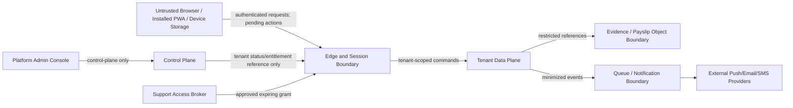

Primary threats and controls include cross-tenant object substitution; platform-console privilege pivot into tenant salary data; fraudulent support impersonation; stolen PWA/session tokens; service-worker cache leakage on shared devices; offline queue tampering/replay; malicious or copied QR material; push-subscription endpoint leakage; feature-flag/entitlement privilege escalation; formula/approval abuse; sensitive telemetry leakage; and supply-chain compromise of app-shell updates. Controls are deny-by-default tenant derivation, separate control/data-plane principals, consented support grants, fresh/step-up authentication, server-side authorization on every mutation, signed/versioned app assets and QR challenges, encrypted/session-bound local payloads, idempotency/nonces/digests, CSP and web-platform hardening, cache classification, endpoint encryption, release checker controls, audit/alerts, and rapid revocation.

Platform service health and usage telemetry must use aggregates or opaque tenant references and must not copy payroll amounts or evidence into the control plane. Feature flags and entitlements gate availability but never grant domain permissions or bypass maker-checker/readiness rules.

### 20.3 Privacy

Collect only evidence required by defined purposes. Disclose why location/device data is collected, limit precision and retention, restrict secondary use, and provide tenant-configurable retention subject to platform/legal constraints. Sample-image PII is never copied into seeded or test data. Exports are permissioned, watermarked where appropriate, encrypted, time-limited, and audited.

### 20.4 Audit Model

Audit is append-only and records actor, actor boundary (platform or tenant), tenant, action, resource/version, before/after digests, reason, authorization decision/policy version, approval/signature evidence, support-case/session grant where applicable, timestamp, correlation, installation/device/session context, and outcome. Tenant lifecycle/status/entitlement changes, support requests/approvals/reads/writes/revocations, break-glass use, app installation and push-subscription lifecycle, app release changes, local-action reconciliation, logout/cache purge signals, and all salary/payslip access are auditable. High-value events are chained or periodically anchored using integrity hashes. Domain tables do not treat generic audit logs as substitutes for first-class approval/consent/acknowledgement entities.

## 21. Observability and Operations

### 21.1 Metrics

- calendar publication and impact-check failures;
- meeting/attendance/dual-confirmation completion latency;
- OT consent completion and expiry rates;
- QR acceptance, replay, location mismatch, and exception rates;
- work records by state, age, dispute, and stale acknowledgement;
- payroll calculation latency, queue lag, failure, and idempotent reuse;
- stale review and readiness blocker counts;
- finalization duration and atomic rollback count;
- notification delivery and overdue task rates;
- authorization denials, cross-tenant guard triggers, and break-glass use;
- tenant provisioning step latency/failure, onboarding age, status transitions, entitlement-evaluation errors, quota saturation, and feature rollout health;
- support-session request/approval/start/expiry/revocation counts, sensitive-access denials, and post-access review completion;
- PWA app-shell/update adoption and failure, install funnel (privacy-safe), capability availability/denial, offline queue depth/age/rejection/conflict, foreground/background retry success, and client purge acknowledgements;
- push subscription health/delivery with in-app/fallback-channel completion, without putting endpoint or worker identity in metric labels;
- web-vital and route/action responsiveness segmented by coarse surface/device/network class, not worker identity.

Sensitive values, worker IDs, compensation amounts, exact locations, and raw identifiers must not appear in general logs or metric labels.

### 21.2 Tracing and Alerts

Correlation and causation IDs trace a business action across edge/session, support grant, offline reconciliation, outbox, calculation, notification, and read-model consumers. Alerts cover persistent calculation failure, growing outbox or offline-reconciliation lag, replay spikes, repeated finalization conflicts, audit pipeline failure, tenant isolation guard activation, unauthorized platform-to-data-plane attempts, support sessions exceeding scope/time, entitlement/flag rollout anomalies, app-shell update failure, sensitive-cache purge failure signals, evidence-store failure, and missed recovery objectives.

### 21.3 Reliability Proposal

- Transactional writes and outbox for state/event atomicity.
- At-least-once event delivery with idempotent consumers.
- Point-in-time database recovery and versioned immutable object storage.
- Tested restore procedures and tenant-scoped export/recovery tooling.
- Availability, recovery-time, recovery-point, and peak payroll throughput targets remain open non-functional decisions.

## 22. Retention, Export, and Integration Extension Points

### 22.1 Retention

Retention classes should distinguish identity/employment data, work records, approval/signature evidence, location/device evidence, payroll snapshots/payslips, audit records, notifications, and transient idempotency material. Exact durations and deletion/anonymization constraints are open and require qualified legal/compliance approval per tenant jurisdiction and contract.

### 22.2 Export

Supported design targets include:

- monthly work card PDF/CSV that preserves recognizable fields and digital statuses;
- OT request/authorization/consent package;
- payroll ledger and calculation breakdown;
- versioned payslip PDF and machine-readable representation;
- audit/evidence package with digests and manifest.

Exports include tenant, period, generated-at time, source versions, report version, classification, and integrity manifest. Export does not flatten away disputes or pending states.

### 22.3 Integrations

Extension points include identity providers, HRIS/worker master import, time-clock/checkpoint devices, accounting/ERP journal export, banking/payment files, notification providers, document signing providers, and statutory reporting adapters after qualified validation. Integrations use versioned APIs/events, scoped credentials, replay protection, reconciliation reports, and dead-letter recovery.

## 23. Correctness Properties

These properties are candidates for property-based and state-machine testing. “For all” applies within any generated valid tenant configuration unless stated otherwise.

### Property 1: Tenant Isolation

```pascal
FOR ALL actor, resource, command
  IF actor.tenant_id != resource.tenant_id THEN
    AUTHORIZE_COMMAND(actor, command, resource) = DENY
    AND command produces no resource data or mutation
  END IF
END FOR
```

### Property 2: Closed-Day Ordinary Work Prohibition

```pascal
FOR ALL site, date, ordinary_command
  IF effective_calendar_day(site, date).kind = CLOSED
     AND ordinary_command has no valid authorized_closed_day_scope THEN
    execute(ordinary_command) = REJECT(CALENDAR_CLOSED)
  END IF
END FOR
```

### Property 3: Closed Classification Preservation

```pascal
FOR ALL approved_closed_day_authorization
  calendar_day(authorization.site, authorization.date).kind = CLOSED
  AND every resulting record displays "Closed — Authorized OT Work"
END FOR
```

### Property 4: Bounded Closed-Day Authorization

```pascal
FOR ALL closed_day_work_record
  record is creatable ONLY IF
    worker IN authorization.worker_ids
    AND supervisor IN authorization.supervisor_ids
    AND record.time WITHIN authorization.time_window
    AND record.location WITHIN authorization.location_scope
    AND worker consented to current authorization.digest before start
END FOR
```

### Property 5: Dual Confirmation Uniqueness

```pascal
FOR ALL meeting, worker, retry_count >= 1
  repeated valid dual-confirmation creation produces exactly one ordinary draft
  AND every returned result references that same draft
END FOR
```

### Property 6: QR Replay Resistance

```pascal
FOR ALL valid_checkout_submission
  first atomic consumption of nonce MAY be accepted
  AND every later submission with same nonce IS rejected
  AND at most one end-time mutation is caused by that nonce
END FOR
```

### Property 7: No Unsafe Batch Signature

```pascal
FOR ALL worker, selected_record
  selected_record is acknowledged in batch ONLY IF
    selected_record.worker_id = worker.id
    AND current.version = reviewed.version
    AND current.digest = reviewed.digest
    AND current.status = PENDING_WORKER_ACKNOWLEDGEMENT
    AND current has no unresolved dispute or blocker
END FOR
```

### Property 8: Per-Record Batch Traceability

```pascal
FOR ALL successful_batch, acknowledged_record
  EXISTS exactly one acknowledgement_item WHERE
    item.record_id = acknowledged_record.id
    AND item.record_version = acknowledged_record.version
    AND item.record_digest = acknowledged_record.digest
    AND item.batch_envelope_id = successful_batch.id
END FOR
```

### Property 9: Worker Acknowledgement Invalidation

```pascal
FOR ALL acknowledged_record_version, authorized_later_edit
  new_version.digest != acknowledged_record_version.digest
  AND old acknowledgement remains historical evidence only
  AND new_version is not acknowledged
END FOR
```

### Property 10: Effective-Dated Compensation Determinism

```pascal
FOR ALL worker, work_date
  applicable approved compensation selection returns at most one unambiguous version
  OR calculation is blocked
END FOR
```

### Property 11: Calculation Idempotency

```pascal
FOR ALL canonical_inputs, engine_version
  calculate(canonical_inputs, engine_version) repeated any number of times
  returns equal result_digest and equal calculation lines
  AND creates at most one successful result for the idempotency key
END FOR
```

### Property 12: No Duplicate Work Counting

```pascal
FOR ALL payroll_result, work_record_version
  work_record_version contributes to at most one mutually exclusive payable classification
  per calculation scope unless an explicit rule decomposes it into non-overlapping segments
END FOR
```

### Property 13: Stale Review Reopening

```pascal
FOR ALL reviewed_ledger_entry
  IF any referenced source version changes such that input_digest changes THEN
    review.status = STALE_OR_REOPENED
    AND entry is not finalizable until recalculated and reviewed at current digest
  END IF
END FOR
```

### Property 14: Finalization Atomicity

```pascal
FOR ALL payroll_period finalization attempts
  EITHER one complete immutable snapshot and all included payslip versions exist
  OR no new snapshot/payslip from that attempt exists
END FOR
```

### Property 15: Snapshot Provenance Closure

```pascal
FOR ALL finalized_snapshot, calculation_line
  every source, calendar, compensation, rule, adjustment, and engine version
  required to reproduce calculation_line is referenced and locked by snapshot
END FOR
```

### Property 16: Maker-Checker Separation

```pascal
FOR ALL action governed by separation_policy
  maker.id != effective_checker.id
  AND checker held required permission and scope at approval time
END FOR
```

### Property 17: Estimate Visibility

```pascal
FOR ALL worker, current_period
  IF tenant_policy.hide_worker_monetary_estimates = TRUE THEN
    worker response exposes no current monetary estimate
  END IF
  AND every published finalized payslip for worker is visible to that worker
END FOR
```

### Property 18: Fixed-Precision Conservation

```pascal
FOR ALL payroll_result
  gross = SUM(basic, normal, overtime, incentive, allowance, positive_adjustment)
  AND net = gross - SUM(advance, deduction, negative_adjustment)
  under the exact configured rounding sequence
END FOR
```

### Property 19: Platform-Admin Cross-Tenant and Salary Isolation

```pascal
FOR ALL platform_actor, tenant_resource
  IF action is not an authorized control_plane_action
     AND no active tenant-approved support_session covers exact tenant, purpose, action, data_class, and time THEN
    access(platform_actor, tenant_resource) = DENY
    AND response reveals no tenant payroll, salary, payslip, evidence, or existence detail
    AND no tenant mutation occurs
  END IF
END FOR
```

### Property 20: Support Session Boundedness and Attribution

```pascal
FOR ALL support_session, attempted_action
  action MAY proceed ONLY IF
    session.status = ACTIVE
    AND CURRENT_TIME < session.expires_at
    AND attempted_action.tenant_id = session.tenant_id
    AND attempted_action.scope IS SUBSET OF session.approved_scope
    AND action still passes tenant domain authorization
  AND every attempt is audited with platform_actor_id, tenant_id, support_case_id, session_id, purpose, and outcome
END FOR
```

### Property 21: Role/Surface Authorization Equivalence

```pascal
FOR ALL actor, action, resource, surface IN {WORKER_PWA, SUPERVISOR_PWA, MANAGEMENT_WEB, TENANT_ADMIN, PLATFORM_ADMIN, API}
  server_authorization(actor, action, resource) is independent of surface
  AND hiding OR showing a client control cannot grant permission
  AND an action allowed from one surface is denied from every other surface when actor context lacks the same permission and scope
END FOR
```

### Property 22: PWA Offline Action Non-Finality

```pascal
FOR ALL queued_offline_action
  BEFORE successful server validation
    authoritative_domain_state is unchanged
    AND client_status = PENDING
  AFTER reconciliation
    exactly one of SERVER_ACCEPTED, SERVER_REJECTED, CONFLICT, EXPIRED is visible
    AND only SERVER_ACCEPTED may cause at most one authoritative mutation
END FOR
```

### Property 23: Safe Logout and Revocation Purge

```pascal
FOR ALL installation, termination_signal IN {LOGOUT, SESSION_REVOKED, ROLE_REMOVED, TENANT_SUSPENDED, REMOTE_WIPE}
  after process(termination_signal)
    no token, session_key, pending_sensitive_payload, salary, payslip, evidence, or roster cache is readable
    AND no background retry can authenticate
    AND future sensitive action requires fresh authentication and authorization
END FOR
```

### Property 24: Installability Is Not Required for Functionality

```pascal
FOR ALL supported_browser, authorized_core_workflow
  IF installation_capability = UNAVAILABLE OR user_declines_installation THEN
    workflow remains reachable and server semantics equal browser_and_installed_modes
  END IF
  AND installation_state never changes actor permissions
END FOR
```

### Property 25: Capability Fallback Safety

```pascal
FOR ALL capability IN {PUSH, BACKGROUND_SYNC, CAMERA, GEOLOCATION, DURABLE_STORAGE}
  IF capability = UNAVAILABLE OR DENIED THEN
    system presents documented fallback OR explicit exception process
    AND does not silently mark required evidence complete
    AND does not weaken tenant, consent, attendance, checkout, acknowledgement, or payroll invariants
  END IF
END FOR
```

### Property 26: Tenant Provisioning Retry Convergence

```pascal
FOR ALL valid_provisioning_request, retry_count >= 1
  repeated execution with same idempotency_key converges on one tenant_id
  AND every completed resource is bound to that tenant placement
  AND tenant cannot become ACTIVE before all mandatory onboarding/security checks pass
END FOR
```

### Property 27: Entitlements Do Not Grant Domain Authority

```pascal
FOR ALL actor, feature, domain_action
  entitlement_enabled(actor.tenant_id, feature) = TRUE
  does not imply authorize(actor, domain_action) = ALLOW
  AND entitlement changes cannot bypass maker_checker, tenant_scope, readiness, or immutable_snapshot rules
END FOR
```

## 24. Testing Strategy

### 24.1 Unit Tests

- policy evaluation, resource scoping, SoD combinations, and role/surface authorization equivalence;
- platform control-plane versus tenant data-plane routing, lifecycle transitions, entitlement snapshots, quotas, and support-session scope/expiry;
- manifest/start-URL selection, installation registration, update decisions, push-subscription revocation, offline queue state, and secure client purge;
- calendar transitions and Closed-day guards;
- effective-date selection and overlap rejection;
- QR signature, expiry, nonce, scope, and location decisions;
- duration, break, classification, rounding, and money arithmetic;
- digest canonicalization and changed-since-review detection;
- readiness blocker classification and snapshot construction.

### 24.2 Property-Based Tests

Use the implementation language’s mature property-testing library; the exact library is an open technology choice. Generate tenants, calendars, time zones including daylight-saving transitions, assignments, authorization windows, record histories, compensation intervals, formulas, retries, concurrency orderings, and monetary values. Execute all properties in Section 23, shrink failures, and retain counterexamples as regression fixtures.

### 24.3 Model/State-Machine Tests

Compare API command sequences against abstract models for calendar, OT, work record, batch acknowledgement, and payroll states. Generate invalid transitions, repeated events, delayed events, and conflicting writes. Assert domain invariants and no hidden state advance.

### 24.4 Integration Tests

- published calendar through meeting, attendance, checkout, verification, acknowledgement, calculation;
- Working-day OT and Closed-day OT with consent timing;
- source correction causing review reopening and scoped recalculation;
- offline queue replay and nonce reconciliation;
- outbox delivery, duplicate events, dead-letter recovery, and read-model convergence;
- immutable evidence retrieval and permission checks;
- tenant provisioning retry/resume, activation gates, restriction/suspension behavior, entitlement/flag changes, and quota enforcement;
- consented support session approval/start/use/revocation/expiry, sensitive-field masking, dual attribution, and break-glass review;
- Worker/Supervisor manifest installability checks and browser-mode parity across supported browser/device matrix;
- service-worker update during active forms, offline queue restart/replay, foreground retry, push failure fallback, capability denial paths, logout/revocation purge, and fresh-auth sensitive actions;
- finalization rollback under injected failures.

### 24.5 Security and Isolation Tests

- cross-tenant ID substitution across every API, object reference, support-session scope, offline action, cache key, push subscription, and control-plane lookup;
- platform-admin attempts to infer or mutate tenant salary/payroll with no session, wrong tenant, expired/revoked session, excess scope, or forged consent;
- salary-field inference through lists, errors, exports, app caches, notifications, logs, metrics, events, support diagnostics, and browser history;
- privilege escalation and maker-checker bypass attempts;
- replay, expired challenge, copied QR, device sharing, and location spoof signals;
- session fixation, CSRF, rate limits, object access, upload validation, and signed URL expiry;
- audit completeness and integrity verification.

### 24.6 UX and Accessibility Tests

Test all role dashboards and navigation against permission combinations, and test desktop grid/mobile date-list with 28–31 day months, long localized labels, right-to-left readiness, Closed rows, authorized exceptions, pending/disputed records, keyboard-only use, screen readers, 200–400% zoom/reflow, contrast, reduced motion, touch/gesture alternatives, and slow/offline networks. Validate loading, empty, error, permission, maintenance, Pending, conflict, stale, success, and capability-denied states. Confirm users can identify exactly which dates will be batch acknowledged and why any item was excluded.

Run automated accessibility checks as a floor plus manual assistive-technology reviews for critical workflows. Perform responsive visual regression across agreed breakpoints, component-state contract tests, localization pseudo-language/text expansion, chart/table equivalence, task-based usability studies with Worker/Supervisor/HR/Admin roles, and release-gate review of severe usability/accessibility defects. PWA quality gates include manifest/service-worker checks, installed and browser parity, update recovery, offline non-finality wording, permission-prompt comprehension, and no sensitive cache artifacts after logout/revocation.

### 24.7 Performance and Reliability Tests

Load profiles must include morning attendance spikes, shift-end checkout spikes, mass PWA foreground reconciliation after connectivity restoration, notification/push bursts with fallback, app-shell release/update fetch, tenant provisioning waves, support-session audit load, month-end bulk review/recalculation, and tenant-wide finalization. Test calculation partitioning by tenant/period/worker, queue backpressure, noisy-neighbor controls, quota enforcement, CDN/app-shell cache behavior without tenant data leakage, database failover, restore, and evidence-store degradation. Establish numeric budgets for route/app-shell load, interaction responsiveness, API latency by command class, offline reconciliation age, update adoption, payroll calculation/finalization, availability and recovery before implementation sign-off; exact values remain open.

## 25. Rollout and Migration Assumptions

### 25.1 Rollout Proposal

1. Provision tenant, sites, time zones, identities, roles, SoD policy, and retention settings.
2. Import/verify worker profiles and effective assignments without sample-image PII.
3. Configure and checker-approve compensation profiles and calculation rules.
4. Publish a future monthly calendar.
5. Pilot meetings, attendance, and work records at one site without payroll finalization.
6. Run shadow payroll and reconcile against approved legacy calculations.
7. Enable worker acknowledgement and controlled batch flow.
8. Enable payroll finalization only after readiness, reconciliation, security, and compliance sign-off.
9. Expand by site with monitored exception rates and rollback criteria.

### 25.2 Paper Migration

Historical paper cards/forms may be represented as imported immutable source evidence plus verified transcription. Each import records source period, importer, verifier, quality status, field mapping, and file digest. OCR may assist but cannot silently create verified facts. Historical imports must be labeled as migrated and must not fabricate digital attendance, QR, consent, or signature events.

### 25.3 Reconciliation

Before go-live, compare worker/day totals, categorized OT, incentives, allowances, advances/deductions, gross, and net. Differences require reason-coded disposition. Shadow results remain non-final and cannot publish payslips.

## 26. Dependencies and Technology Decisions

### Required Capabilities

- transactional relational persistence with strong constraints;
- immutable/versioned object storage;
- identity provider with MFA and enterprise federation extension;
- key management/signing and secret rotation;
- durable queue/event delivery and scheduler;
- push/in-app notification provider, with optional email/SMS;
- fixed-precision calculation runtime and constrained expression evaluator;
- PDF/report rendering with accessible templates;
- centralized logs, metrics, traces, and security alerting;
- standards-compliant web manifests, scoped service workers, app-shell delivery/CDN controls, push subscription lifecycle, and browser capability detection;
- shared accessible responsive design system, localization pipeline, automated/manual accessibility tooling, responsive visual testing, and web-performance monitoring;
- control-plane tenant provisioning/status/entitlement/usage services and support-session broker separated from tenant payroll data.

### Technology Choices Still Open

No programming language, application framework, database product, cloud provider, notification vendor, property-testing library, or signing provider has been confirmed. Requirements should remain technology-neutral unless implementation constraints are later supplied.

## 27. Performance Considerations

- Partition work and payroll queries by tenant, payroll period, site, and worker.
- Maintain read models for monthly card and payroll ledger rather than joining full audit/evidence history on each page.
- Recalculate only workers/periods affected by a source-version dependency graph.
- Deduplicate concurrent calculation requests by input digest.
- Stream large exports and generate them asynchronously with expiring access.
- Keep evidence metadata in transactional storage while binary objects remain in object storage.
- Apply tenant-aware quotas and fair scheduling to avoid noisy neighbors.
- Finalization performs a consistent digest check under a period-level lock without locking unrelated tenants or periods.

### 27.1 Performance Budget Framework

**Confirmed**: measurable performance and perceived-responsiveness budgets are required and enforced in CI/pre-release monitoring. **Open**: numeric thresholds and percentile targets.

| Budget class | Measurement and gate |
|---|---|
| PWA/web startup | compressed app-shell/critical asset size, first useful route, largest content display, layout stability, blocking time by agreed device/network tier |
| Interaction | input-to-feedback and server-confirmed completion for attendance, consent, checkout, acknowledgement, common admin edits |
| API | percentile latency/error budget by read, standard mutation, evidence upload, calculation, export and finalization class |
| Offline reconciliation | queue age, time-to-first-retry, drain rate, conflict/rejection visibility after reconnect |
| Data views | monthly Work Record card, roster, audit and payroll ledger initial page/filter/sort response at agreed row volumes |
| Background work | event/outbox lag, notification/push delivery, calculation completion, report generation and app-update adoption |
| Reliability | availability, recovery time/point, tenant provisioning completion, and maximum noisy-neighbor impact |

Budgets are tested on representative low/mid/high supported devices and constrained networks, not only developer hardware. Regressions over the agreed budget block release or require an explicit time-bound exception owner. Sensitive responses remain `no-store` even if caching would improve synthetic scores.

## 28. Open Decisions

These are intentionally not finalized by this design:

1. Exact tenant tiers and whether dedicated database/key isolation is required for some tenants.
2. Implementation language, framework, cloud, database, event infrastructure, and mobile delivery model.
3. Exact permission catalog, default role templates, risk tiers, approval counts, amount thresholds, and emergency/break-glass policy.
4. Whether calendar scope is tenant-wide, legal-entity, site-specific, shift-specific, or a controlled combination.
5. Meeting timing rules, grace periods, late/absence policy, and how supervisor/worker arrival time disagreement resolves.
6. QR checkpoint hardware model, challenge lifetime, acceptable device/location evidence, offline tolerance, and privacy notice/retention.
7. Whether worker acknowledgement is required daily, by configured cadence, or before payroll cutoff; batch size and signing authentication level.
8. Which unresolved states are finalization blockers versus warnings, subject to non-downgradable platform integrity guards.
9. Compensation formulas, standard days/hours, OT categories, rates, caps, rounding, allowances, incentives, advances, deductions, and eligibility rules.
10. Singapore PTE/MOM/contract-specific interpretation and required reports, to be validated by qualified stakeholders; this document is not legal advice.
11. Payroll period cutoff, time zone boundary, approval calendar, publication timing, and whether finalization is all-workers atomic or supports explicitly authorized cohorts.
12. Worker estimate visibility default and which line-level projections are appropriate before finalization.
13. Retention periods, data residency, lawful deletion constraints, evidence export format, and audit anchoring policy.
14. Availability, latency, throughput, recovery-time, recovery-point, and support service-level objectives.
15. Notification channels, escalation timings, multilingual requirements, and accessibility conformance target.
16. Legacy import volume, OCR usage, dual verification requirements, and how much historical payroll is migrated.
17. Accounting/HRIS/banking/statutory integration priorities and contract schemas.
18. Future post-final correction/revised/off-cycle workflow requirements; this remains an extension point only.
19. SaaS plans, subscription/billing ownership, metering, trials/grace, feature entitlements, quota enforcement, and what is merely commercial packaging versus a hard technical guard.
20. White-label scope: tenant branding, app names/icons, email/template branding, custom domains, certificate/domain verification, and whether platform/legal identity must remain visible.
21. Separate versus unified Worker/Supervisor PWA distribution details, including manifest scope, icon/app naming, authorized role switching, app-store wrappers (if any), and release cadence; separate manifests/start URLs on shared codebase are recommended.
22. Supported browser, OS, device, camera, storage, installability, and assistive-technology baseline; minimum network conditions; offline depth/action allowlist, queue expiry/size, and device-support policy.
23. Push provider(s), web-push platform coverage, user preference/consent rules, delivery guarantees, and fallback priority across in-app, email, SMS, or other approved channels.
24. Initial localization languages, right-to-left requirement, translation ownership, tenant-editable terminology, locale/time-zone defaults, and fallback locale.
25. Whether Management/HR/Payroll, Tenant Management Admin, and Platform Admin receive installable PWA manifests; they remain responsive web applications regardless.
26. Confirmation of WCAG 2.2 AA as the accessibility target, supported assistive-technology test matrix, audit cadence, and exception governance.
27. Numeric performance budgets and service objectives: web vitals/app-shell size, interaction/API percentiles, offline reconciliation age, data-view volumes, notification/update latency, payroll throughput, availability, recovery time and recovery point.

## 29. Design Rationale Summary

- **Calendar as authorization boundary** prevents ordinary work from appearing on Closed dates through convenience edits.
- **Separate OT authorization and consent** distinguishes organizational approval from individual pre-work agreement.
- **Version-and-digest signatures** preserve what each person actually approved or acknowledged.
- **Per-record items inside batch envelopes** reduce worker burden without creating blanket consent.
- **Append-only provenance and immutable snapshots** make payroll reproducible and source changes visible.
- **Modular transactional core plus outbox** protects cross-context invariants while retaining a scale-out path.
- **Paper-inspired, not paper-constrained UX** maintains familiarity while exposing status, evidence, accessibility, responsive role workflows, and safe actions.
- **Separate platform and tenant administration** prevents SaaS operations from becoming a hidden payroll superuser while still supporting lifecycle, health, and audited customer support.
- **Distinct Worker/Supervisor manifests on a shared frontend foundation** optimize each installable shell without duplicating security, design-system, or domain behavior.
- **Progressive capability degradation and non-final offline queues** preserve workflow availability without weakening evidence or authorization rules.
- **Shared tokens/components and measurable UX gates** make polished mobile/desktop behavior, accessibility, localization, and perceived performance systemic rather than screen-by-screen aspirations.
- **Configurable formulas with qualified validation** avoids embedding unverified statutory or contractual assumptions.
